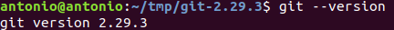
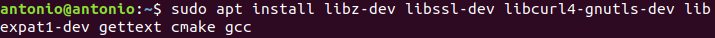
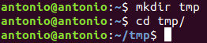
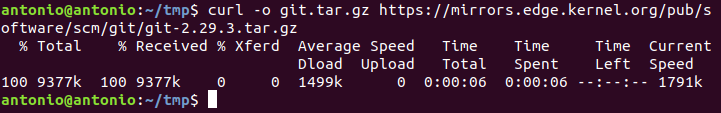
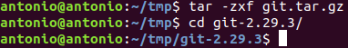
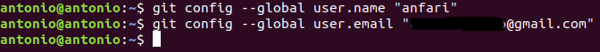
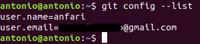
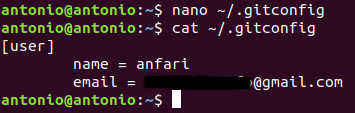

# Instalación y Configuración Git

## Requisitos previos
Esta guía esta destinada a la instalación de Git en una máquina Linux, la distribución que se muestra en el ejemplo es Ubuntu.

## Instalación de Git

### Instalación con paquetes predeterminados

Esta es la opción más común y recomendable para una instalación rápida de Git. La contraparte es que no te instala la última versión disponible ni ninguna que busques específicamente.

A veces Git ya viene instalado por defecto, podemos comprobarlo utilizando el comando:
```
git --version
```

Si le aparece un resultado tal que así es que está instalado:



En caso contrario ejecutamos el siguiente comando para actualizar los repositorios, lo cual siempre es recomendable hacer:
````
sudo apt update
````

Y seguidamente instalaremos Git:
````
sudo apt install git
````

Al finalizar tendremos git instalado y podremos comprobarlo ejecutando de nuevo el comando:
````
git --version
````

### Instalación desde la fuente

Con esta opción podemos elegir descargar la versión más reciente de Git, aunque el proceso de instalación se alarga un poco.

Lo primero será de igual manera comprobar si Git está ya instalado con el comando:
````
git --version
````

Si le aparece un resultado tal que así es que está instalado:


Para comenzar la instalación actualizamos los repositorios ejecutando:
````
sudo apt update
````


Seguidamente instalamos los paquetes necesarios:
````
sudo apt install libz-dev libssl-dev libcur14-gnutls-dev libexpat1-dev gettext cmake gcc
````


Tras esto crearemos un directorio temporal donde descargar Git.



Y procedemos a descargar la versión que deseemos de Git, estas podemos encontrarlas en su lista de tarball disponibles https://mirrors.edge.kernel.org/pub/software/scm/git/
````
curl -o git.tar.gz https://mirrors.edge.kernel.org/pub/software/scm/git/git-2.29.3.tar.gz
````


Descomprimimos el archivo descargado y entramos en la carpeta:
````
tar -zxf git.tar.gz
````


Creamos el paquete:
````
make prefix=/usr/local all
````


Y lo instalamos:
````
sudo make prefix=/usr/local install
````


Por último sustituimos el proceso de shell para ejecutar la versión recién instalada de Git:
````
exec bash
````


Podemos comprobar que la versión deseada está instalada:


## Configuración de git

Se debería realizar una configuración básica de Git para que los mensajes de confirmación generados contengas información correcta.

Para ello utilizaremos el comando **git config**, que nos permitirá añadir nuestro nombre y correo a la información que Git genera, esto lo haremos con los comandos:

````
git config --global user.name "name"
git config --global user.email "email@domain.com"
````


Para ver los datos guardados en la configuración ejecutamos:
````
git config --list
````


Esta información es guardada en el archivo de configuración de Git, el cual podemos editar manualmente con un editor de texto como **nano**, por ejemplo.


