# Aplicación NodeJS en Docker

## Índice
- <a href="#1">Crear la aplicación Node.js</a>
- <a href="#2">Crear el Dockerfile</a>
- <a href="#3">Fichero .dockerignore</a>
- <a href="#4">Construir la imagen</a>
- <a href="#5">Ejecutar la imagen</a>
- <a href="#6">Acceso web</a>


# <a name="1">Crear la aplicación Node.js</a>

Lo primero será crear un directorio que contendrá todos los fichero necesarios y dentro de este crear el un fichero **package.json** con el siguiente contenido.

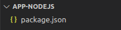

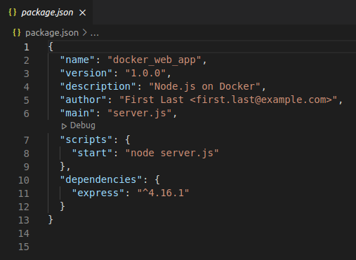

Hecho esto ejecutaremos el comando:

```
npm install
```

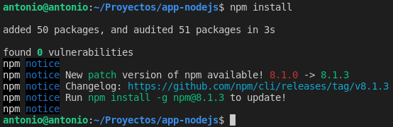

Esto nos generará un fichero **package-lock.json** en caso de tener la versión 5 o superior de npm.

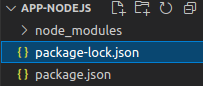

Lo siguiente será crear el fichero **server.js** con el siguiente contenido.

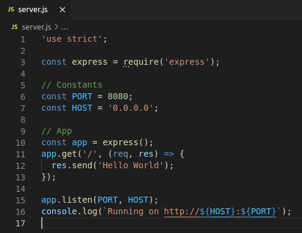


# <a name="2">Crear el Dockerfile</a>

Ahora tenemos que crear un fichero **Dockerfile** en el directorio con las siguientes instrucciones.

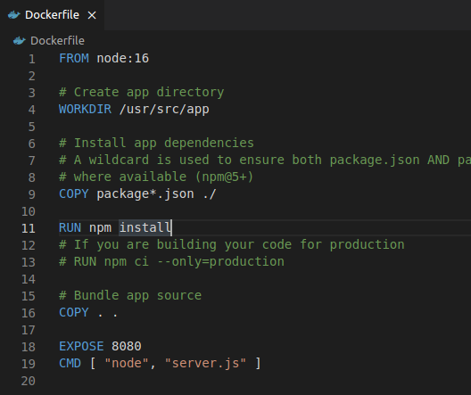


# <a name="3">Fichero .dockerignore</a>

Crearemos un fichero **.dockerignore** que evitará que los módulos locales y logs de debug sean copiados en la imagen docker.

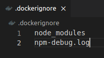


# <a name="4">Construir la imagen</a>

Dentro del directorio ejecutaremos el siguiente comando:

```
sudo docker build . -t nombre
```

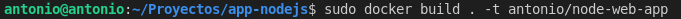

El resultado final debería ser tal que:

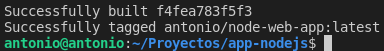

Podemos consultar la imagen en el listado de docker ejecutando:

```
sudo docker images
```

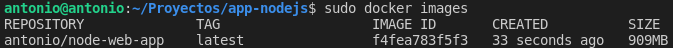


# <a name="5">Ejecutar la imagen</a>

Ahora crearemos un contenedor con la imagen creada ejecutando el comando:

```
sudo docker run -p 49160:8080 -d nombre
```

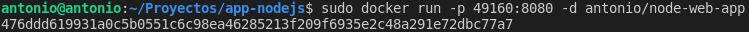

Podemos consultar el ID del contenedor ejecutando:

```
sudo docker ps
```

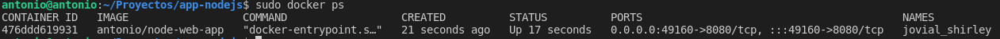

Y consultar sus logs mediante el ID ejecutando:

```
sudo docker logs ID
```

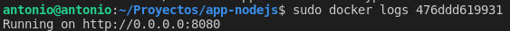


# <a name="6">Acceso web</a>
Finalmente podemos consultar nuestra aplicación accediendo mediante el navegador al puerto especificado.

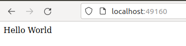
