# Balanceo de carga en Apache

## Índice
- <a href="#1">Activación de los módulos necesarios de Apache</a>
- <a href="#2">Configuración de Apache para balancear la carga del tráfico HTTP</a>
- <a href="#3">Creación del proyecto y contenedores</a>


# <a name="1">Activación de los módulos necesarios de Apache</a>

Lo primero será activar todos los módulos necesarios:

```
a2enmod proxy
a2enmod proxy_http
a2enmod proxy_ajp
a2enmod rewrite
a2enmod deflate
a2enmod headers
a2enmod proxy_balancer
a2enmod proxy_connect
a2enmod proxy_html
a2enmod lbmethod_byrequests
```

Esto lo haremos con permisos de sudo.


En la activación nos pedirá reiniciar el servicio, pero esperaremos a activarlos todos.

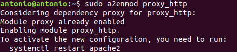


# <a name="2">Configuración de Apache para balancear la carga del tráfico HTTP</a>

Vamos a editar el fichero de configuración por defecto **/etc/apache2/sites-enable/000-default.conf** al que añadiremos las siguientes lineas **dentro del VirtualHost**.

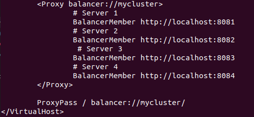

Y reiniciamos el servicio de apache:

```
sudo systemctl restart apache2
```

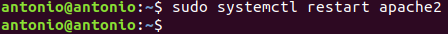


# <a name="3">Creación del proyecto y contenedores</a>

Para esto aprovecharemos un proyecto anterior que mostraba el puerto por el que realizábamos la conexión.

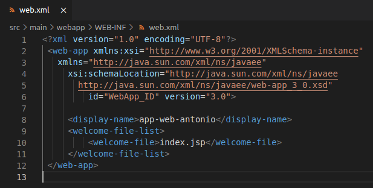

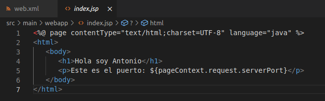

El fichero **dockerfile** será el mismo empleado para wildfly en las anteriores ocasiones.

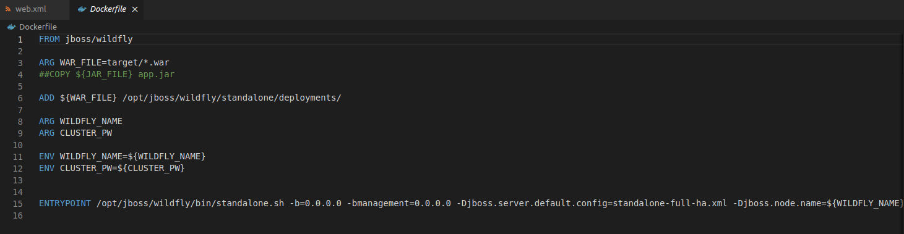

Y en el fichero **docker-compose.yml** configuraremos solo los contenedores wildfly.

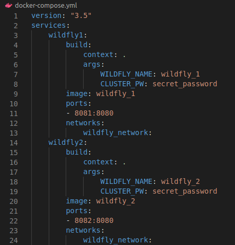

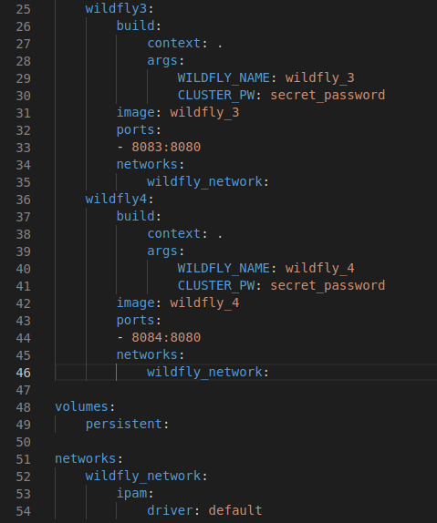

Hecho esto solo compilaremos el proyecto.

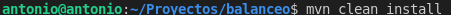

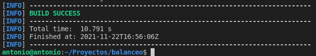

Y lanzaremos la creación de los contenedores:

```
sudo docker-compose up -d –build
```


Y comprobamos que se han creado correctamente y escuchan en el puerto deseado:

```
sudo docker ps
```

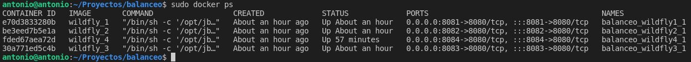

Y hemos terminado la configuración, si accedemos a apache desde el navegador nos irá redireccionando a los diferentes puertos disponibles por orden para balancear la carga.


