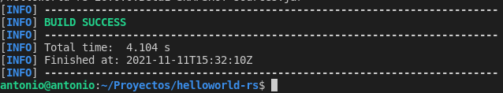

# Clusterizando un Servicio Rest en Wildfly

## Índice
- <a href="#1">Diagrama Docker</a>


# <a name="1">Diagrama Docker</a>

Tendremos 6 contenedores que conforman el sistema a construir.

**Servidores wildfly:**
* Nombres: **wildfly1, wildfly2, wildfly3**
* Puertos: **8081, 8082, 8083**

**Servidor web:**
* Nombre: **www**
* Puerto: **80**

**Servidor de base de datos:**
* Nombre: **db**
* Puerto: **3306**

**Servidor del sistema gestor de base de datos gráfico:**
* Nombre: **phpmyadmin**
* Puerto: **8000**

Como proyecto utilizaremos uno de los ejemplos de wildfly **helloworld-rs** y su estructura es la siguiente:


En el fichero **Dockerfile de wildfly** especificamos la copiar de **.war** en la ruta de despliegues, la asignación de nombres y algunos atributos.


En el fichero **Dockerfile de apache** especificaremos la instalación de la versión **8.0.0 de php con apache**. También modificaremos la variable de entorno DEBIAN_FRONTES a modo no interactivo e instalaremos algunas extensiones de comunicación y actualizaciones de repositorio.


En el fichero **docker-compose.yml** definiremos los servicios **wildfly, www, db, phpmyadmin y las network**.


Creada toda las estructura del proyecto debemos construir el **.war**:

```
mvn clean install
```




Ya solo tendremos que construir los contenedores ejecutando:

```
sudo docker-compose up -d --build
```


Y comprobamos si los contenedores funcionan correctamente ejecutando.

```
sudo docker-compose ps
```


Si accedemos desde el navegador deberíamos poder acceder a la web de widfly de los diferentes contenedores por los diferentes puertos.


Y comprobamos también el acceso a la aplicación desplegada desde los distintos contenedores.


También podemos comprobar el acceso a **phpmyadmin** accediendo desde el puerto **8000** con las credenciales especificadas en **docker-compose.yml**.


