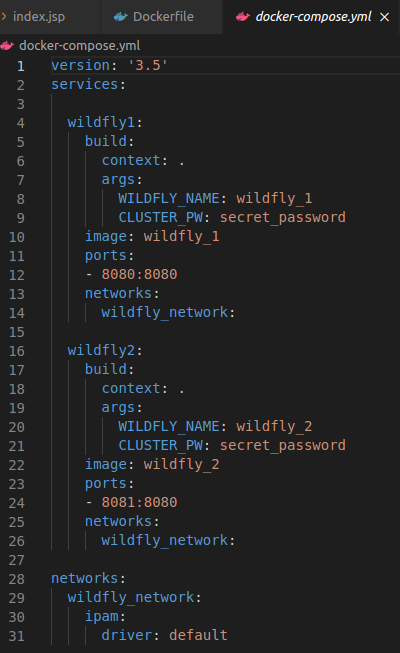

# Clusterizando una App en Windfly

## Índice
- <a href="#1">Desplegando un Cluster de Jboss con Docker</a>
- <a href="#2">Construcción del proyecto</a>


# <a name="1">Desplegando un Cluster de Jboss con Docker</a>

Para esto vamos a hacer uso de la imagen de docker de Widfly que tenemos.


## <a name="2">Construcción del proyecto</a>

En el repositorio hay disponible un proyecto de app en Java, donde cambiaremos en el fichero **web.xml** el nombre ubicado en **\<display-name>….**:


Así como también en el saludo del **index.jsp**:


Ya podremos ejecutar el siguiente comando para crear el **.war** del proyecto, aunque podemos cambiar su nombre final en el **pom.xml** si se desea:

```
mvn clean install
```


Podemos encontrar el **.war** generado dentro de la carpeta **target** del proyecto.


Podemos comprobar el resultado del proyecto en modo local ejecutando:

```
mvn clean jetty:run
```


Y accediendo desde el navegador a **localhost:8082**.


Dentro del proyecto podemos encontrar el fichero **Dockerfile**, donde podemos apreciar el copiado del **.war** en la carpeta **deployments** para luego crear su arranque en cluster.


También tenemos el fichero **docker-compose.yml** que sirve para la construcción del cluster.



Donde podemos apreciar la existencia de dos servidores **wildfly** con distintos puertos de arranque cada uno, **CLUSTER_PW** que es la clave para la construcción del cluster, **networks** que es la subred que estamos construyendo e **ipam** que es la configuración de esa red.

Por último creamos el cluster de los **dos nodos** ejecutando:

```
sudo docker-compose up
```


Con esto podemos comprobar que podemos acceder a la aplicación desde el puerto **8080** y **8081**.


