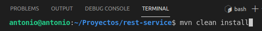
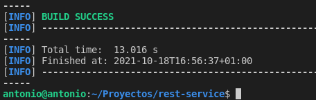
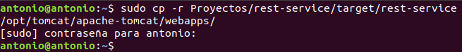
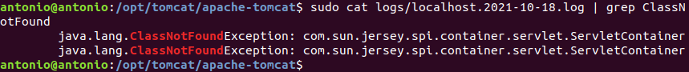
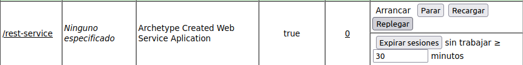
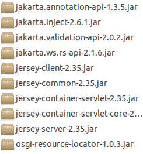
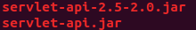
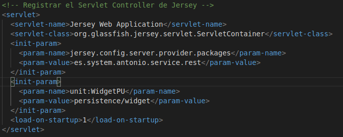
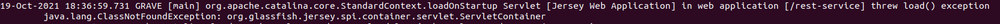

# Despliegue de Servicio Rest en Apache-Tomcat

## Índice
- <a href="#1">Creando nuestro servicio</a>
- <a href="#2">Requisitos previos</a>
- <a href="#3">Construcción del proyecto</a>
- <a href="#4">Despliegue del servicio</a>
- <a href="#5">Consumo del servicio</a>
- <a href="#6">Problemas durante el despliegue</a>


# <a name="1">Creando nuestro servicio</a>

## <a name="2">Requisitos previos</a>

Necesitaremos tener JAVA instalado así como MAVEN.

## <a name="3">Construcción del proyecto</a>

En mi repositorio está disponible un proyecto de una app en Java, lo que haremos será crear el fichero **.war**.





Y copiarlo a la carpeta **webapps**.



# <a name="4">Despliegue del servicio</a>

## <a name="5">Consumo del servicio</a>

El objetivo es verificar el servicio a traves de la url: *http://localhost8082/rest-service/rest/users*.


## <a name="6">Problemas durante el despliegue</a>

Para solucionar los posibles problemas debemos consultar los fichero alojados en la carpeta **logs** de Tomcat:


* **catalina_fecha**
* **localhost_fecha**



Como podemos ver, aunque encontremos errores el servicio está desplegado.



El problema inicial se debería solucionar incluyendo las librerías faltantes en la carpeta **lib** de Tomcat.

Para solucionar el primer error descargué todas las dependencias relacionadas con el error.



Y copié en la carpeta **lib** las faltantes al proyecto, esto lo comprobé en la carpeta **lib** del mismo proyecto, dentro de **WEB-INF**.

Para el siguiente error descargué el servlet correcto, pues la versión no era la apropiada.



Luego cambié en el **web.xml**  el contenido, pues no era el correcto para la versión de **jersey** que estamos utilizando.



Pero aún cambiando el contenido y volviéndolo a cambiar el error persiste cambiando simplemente acorde al nombre del parámetro.



```
GRAVE [main] org.apache.catalina.core.StandardContext.loadOnStartup Servlet [Jersey Web Application] in web application [/rest-service] threw load() exception
	java.lang.ClassNotFoundException: org.glassfish.jersey.spi.container.servlet.ServletContainer
```
