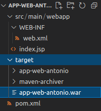

# Despliegue de War en Apache-Tomcat

## Índice
- <a href="#1">Creación de una App Web en Java</a>
- <a href="#2">Requisitos previos</a>
- <a href="#3">Construcción del proyecto</a>


# <a name="1">Creación de una App Web en Java</a>

## <a name="2">Requisitos previos</a>

Necesitaremos una máquina Ubuntu con **Java** y **Maven** instalado. Ya que Java ya lo tenemos instalado, procederemos con la instalación de Maven ejecutando el comando:
```
sudo apt install maven
```


Comprobamos la instalación consultando la versión instalada:
```
mvn -version
```


## <a name="3">Construcción del proyecto</a>

En mi repositorio está disponible un proyecto de una app en Java, donde los únicos cambios a realizar serían sustituir el **nombre** en el fichero **web.xml**:
```
<display-name>app-web-nombre</display-name>
```


Y cambiarlo también en el fichero **index.jsp**:
```
<p>Yo soy nombre</p>
```


También sería conveniente modificar el fichero **pom.xml** para renombrar el paquete final, debemos cambiar el **artifactId** y el **name** para poner el de cada uno.


Pero lo más importante es modificar el **finalName**:


Una vez terminado ejecutamos en la terminal el siguiente comando:
```
mvn clean install
```


Hasta que el proceso acabe con una respuesta similar a esta:


Podremos ver que se ha creado una carpeta **target** y dentro de esta se habrá creado el paquete **war**.



Por último debemos mover este paquete a la carpeta **webapps** en la carpeta de instalación de tomcat, en mi caso:


Hecho esto ya podemos acceder desde el navegador a nuestra aplicación mediante la URL:
```
http://localhost:PUERTO/myapp
```


