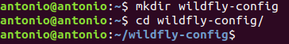
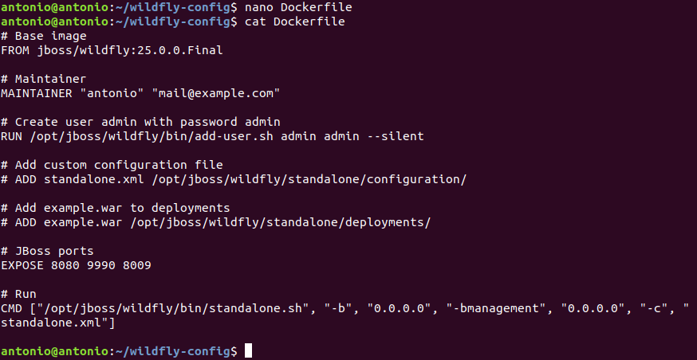
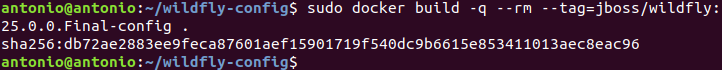
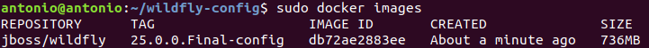
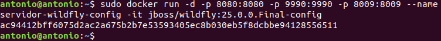
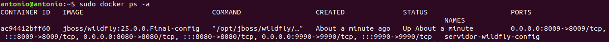
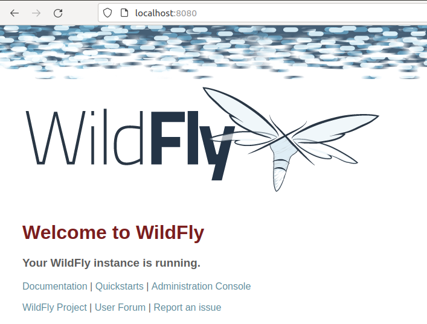
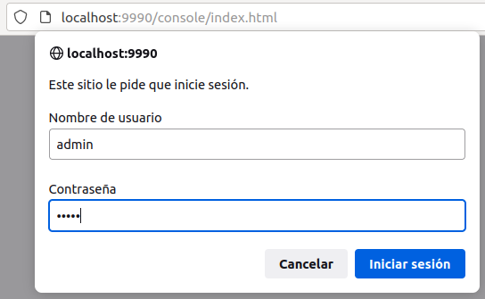
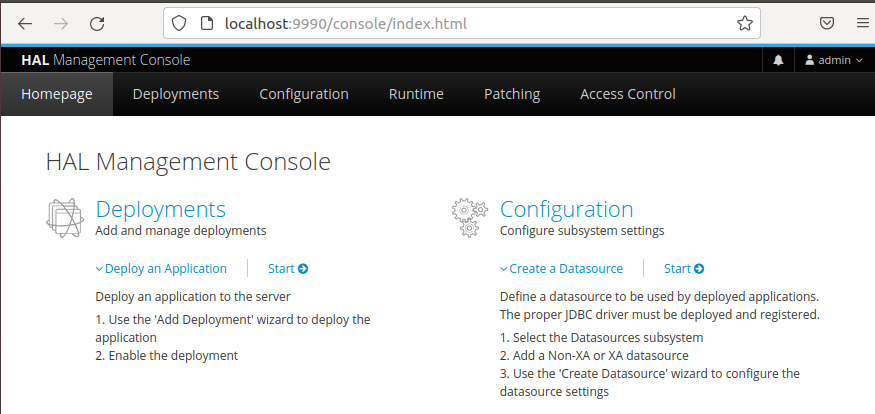

# Dockerizando Wildfly

## Índice
- <a href="#1">Creación del fichero dockerfile para Wildfly</a>
- <a href="#2">Uso de la nueva imagen</a>


# <a name="1">Creación del fichero dockerfile para Wildfly</a>

Lo primero será crear el directorio de trabajo:

```
mkdir wildfly-config
```



Creamos el fichero de configuración con el siguiente contenido:

```
nano Dockerfile
```



Construimos la imagen:

```
sudo docker build -q --rm --tag=jboss/wildfly:25.0.0.Final-config .
```



Y verificamos que existe dentro de docker:

```
sudo docker images
```




# <a name="2">Uso de la nueva imagen</a>

Probamos la imagen recién creada ejecutando:

```
sudo docker run -d -p 8080:8080 -p 9990:9990 -p 8009:8009 --name servidor-wilfly-config -it jboss/wildfly:25.0.0.Final-config
```



Verificamos que el contenedor está arrancado:

```
sudo docker ps -a
```



Ahora ya podemos acceder a Wildfly desde el navegador.



Y podemos comprobar el acceso a la consola de administración con el usuario creado.




