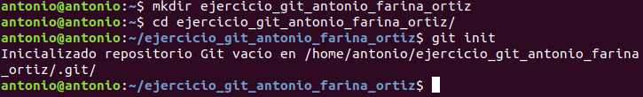
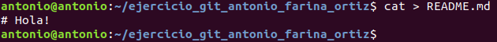
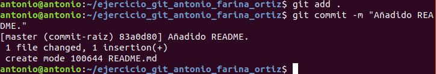
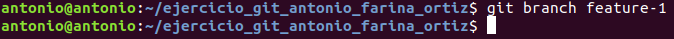
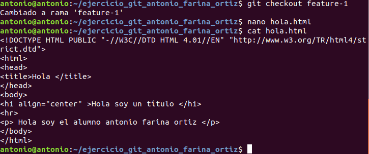
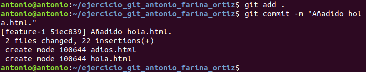
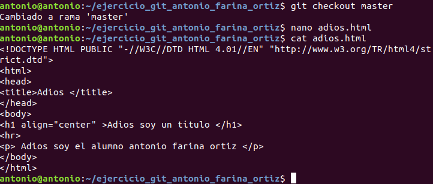
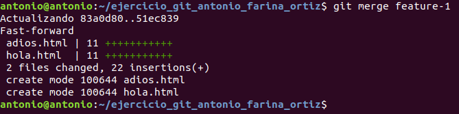
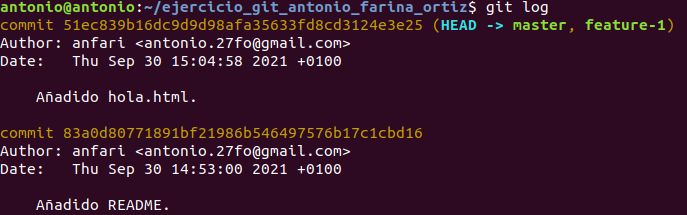
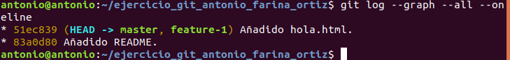

# Ejercicio Práctico Git

Lo primero será crear un directorio con el nombre **ejercicio_git_nombre_alumno** donde iniciaremos el repositorio utilizando el comando:
```
 git init
```


Ahora añadimos el archivo **README**.



Y realizamos el primer commit del repositorio.




Crearemos una nueva rama llamada **feature-1**.



A la cual nos moveremos y crearemos el fichero **hola.html** con el siguiente contenido:



Creamos un commit con la nueva adicción.



Y volvemos a la rama master para crear el fichero **adios.html** con el contenido:



Realizamos una mezcla de las ramas en el repositorio local empleando el comando:
```
git merge nombre_rama
```


Y finalmente mostramos los cambios realizados en el repositorio con el comando **git log** o sus variantes.




