# Instalación Apache-Tomcat

## Índice
- <a href="#1">Requisitos previos</a>
- <a href="#2">Pasos para la instalación en local</a>
- <a href="#3">Actualización de los repositorios</a>
- <a href="#4">Instalación de Apache-Tomcat</a>
- <a href="#5">Acceso</a>


# <a name="1">Requisitos previos</a>

Necesitaremos una máquina Ubuntu con **Java** instalado. Esto lo podemos hacer ejecutando el comando:

```
sudo apt-get install default-jdk
```

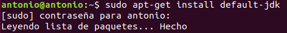


# <a name="2">Pasos para la instalación en local</a>

## <a name="3">Actualización de los repositorios</a>

Antes de cualquier instalación es recomendable actualizar tanto los repositorios como el sistema, por lo que ejecutaremos el siguiente comando:
```
sudo apt update && sudo apt upgrade
```

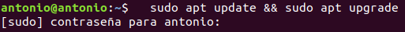

## <a name="4">Instalación de Apache-Tomcat</a>

Lo primero será descargar **Tomcat 10** desde la página de descargas oficial, escogiendo el paquete más recomendable para nuestro sistema operativo, **.tar.gz** en nuestro caso. Esto podemos hacerlo ejecutando el comando:

```
wget https://downloads.apache.org/tomcat/tomcat-10/v10.0.12/bin/apache-tomcat-10.0.12.tar.gz
```

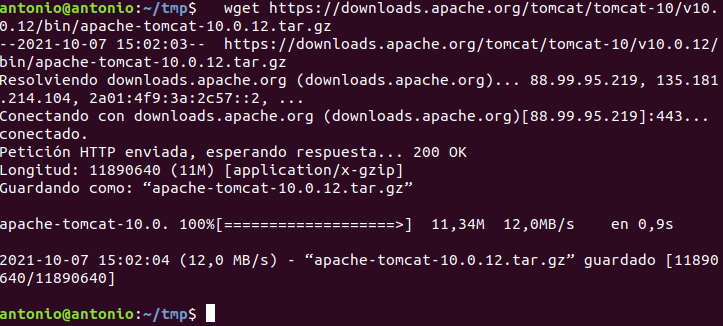

Nuestro objetivo es instalar Tomcat 10 preparando la plataforma como un servicio que corra en el sistema con su propio usuario y grupo, por lo que debemos realizar lo siguiente.

Creamos el usuario tomcat:

```
sudo useradd -U -m -d /opt/tomcat -k /dev/nul -s /bin/false tomcat
```

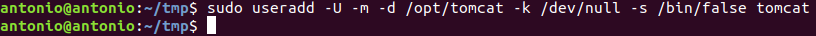

Descomprimimos el paquete descargado en su ubicación definitiva:

```
sudo tar xf apache-tomcat-10.0.12.tar.gz -C /opt/tomcat/
```

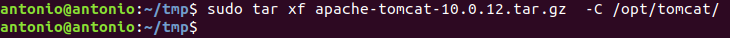

Establecemos a tomcat como propietario de los archivos:

```
sudo chown -R tomcat: /opt/tomcat/
```

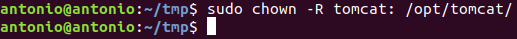

Creamos un enlace simbólico del directorio de instalación para evitar los números de versión del nombre del directorio:

```
sudo ln s /opt/tomcat/apachetomcat-10.0.12/ /opt/tomcat/apache-tomcat
```

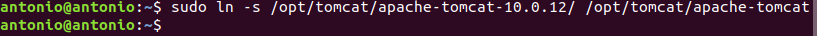

Para lanzar Tomcat 10 como servicio creamos un archivo de unidad para Systemd:

```
sudo nano /etc/systemd/system/tomcat10.service
```


Con el contenido:

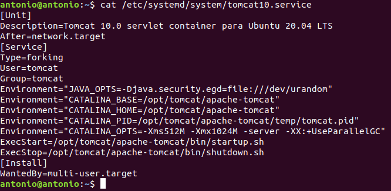

Iniciamos el servicio:

```
sudo systemctl start tomcat10
```

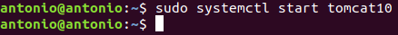

Comprobamos el estado del servicio:

```
sudo systemctl status tomcat10
```

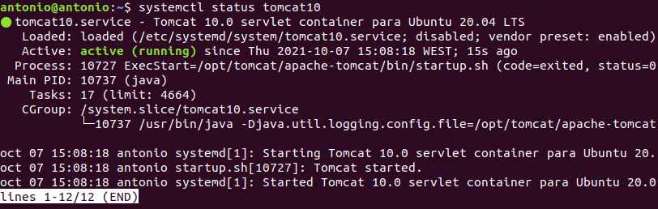

Habilitamos el servicio para que inicie automáticamente en el arranque:

```
sudo systemctl enable tomcat10
```

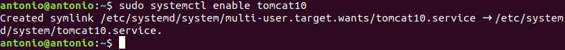


## <a name="5">Acceso</a>

Como los puertos que Tomcat utiliza por defecto los tenemos ocupados con instalaciones anteriores debemos cambiarlo, para ello modificamos el fichero **/opt/tomcat/apache-tomcat/conf/server.xml**.

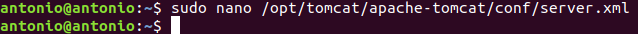

Aquí debemos cambiar el puerto de 8080 a el que deseemos, en nuestro caso 8082.

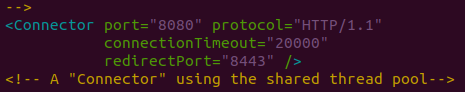
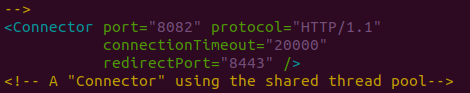

Por último reiniciamos el servicio:

```
sudo systemctl restart tomcat10
```

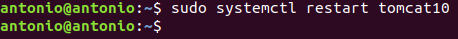

Y accedemos mediante la ip o localhost y el puerto asignado:

```
http://IP:8082 o localhost:8082
```

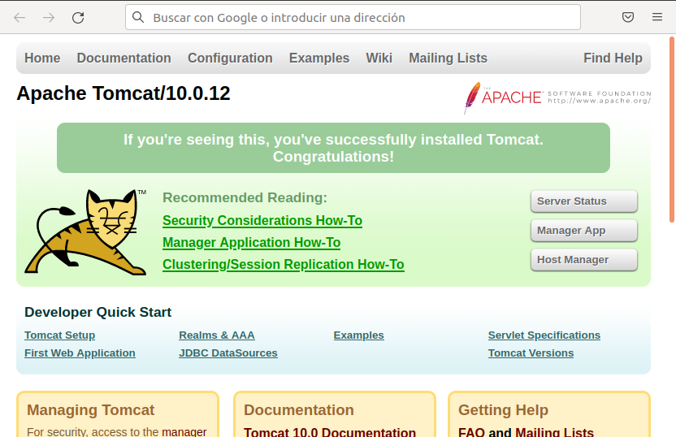

En caso de que la página se quede en blanco al intentar acceder **reiniciar la máquina** puede resolver el problema.
