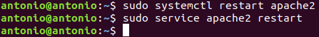

# Instalación Apache

## Índice
- <a href="#1">Pasos para la instalación en local</a>
- <a href="#2">Actualización de los repositorios</a>
- <a href="#3">Instalación de Apache</a>
- <a href="#4">Acceso</a>


# <a name="1">Pasos para la instalación en local</a>

## <a name="2">Actualización de los repositorios</a>

Antes de cualquier instalación es recomendable actualizar tanto los repositorios como el sistema, por lo que ejecutaremos el siguiente comando:
```
sudo apt update && sudo apt upgrade
```


## <a name="3">Instalación de Apache</a>

Lo primero será abrir un terminar e instalar apache ejecutando el siguiente comando:

```
sudo apt install apache2
```


Si nos sale un error como el siguiente:


Es por que tenemos otro servicio ejecutándose en el puerto 80, en nuestro caso GitLab, esto podemos confirmarlo leyendo un poco mas arriba.


Lo que haremos será cambiar el puerto de apache, para ello modificamos el fichero **/etc/apache2/ports.conf** cambiando **Listen 80** al puerto que queramos, en mi caso el **8081**.


También modificamos el fichero **/etc/apache2/sites-enables/000-default.conf** y cambiamos **<VirtualHost: *:80>** por el mismo que en el fichero anterior.


Y reiniciamos los servicios de apache ejecutando:

```
sudo systemctl restart apache2
sudo service apache2 restart
```



Lo siguiente será configurar el Firewall **UFW** que es el que Ubuntu utiliza por defecto, podemos ver una lista de las aplicaciones disponibles ejecutando:

```
sudo ufw app list
```


Como no necesitaremos en nuestro caso conexión cifrada permitiremos **Apache**, esto lo haremos lanzando el comando:

```
sudo ufw allow 'Apache'
```


Comprobamos que se ha hecho correctamente mirando los perfiles activos:

```
sudo ufw status
```


En caso de que salga inactivo, solo tendremos que iniciarlo con **sudo ufw enable**.

Por último comprobamos que el servicio Apache se está ejecutando correctamente:

```
sudo systemctl status apache2
```


## <a name="4">Acceso</a>

Si hemos configurado todo correctamente deberíamos poder acceder desde el navegado introduciendo la ip del servidor o localhost y el puerto asignado, el 8081 en mi caso.

```
http://IP:8081 o localhost:8081
```

La página que debería cargar es la siguiente.


