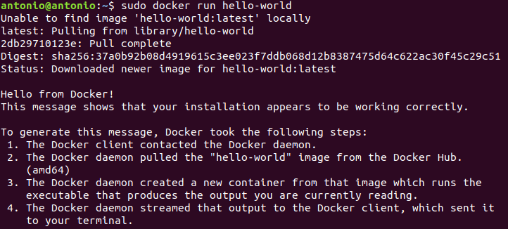

# Instalación de Docker

## Índice
- <a href="#1">Instalar Docker</a>
- <a href="#2">Trabajar con imágenes de Docker</a>
- <a href="#3">Administrar contenedores de Docker</a>


# <a name="1">Instalar Docker</a>

Lo primero será actualizar la lista de paquetes:

```
sudo apt update && sudo apt upgrade
```


Instalamos los paquetes necesarios para permitir a apt utilizar paquetes a través de HTTPS:

```
sudo apt install apt-transport-https ca-certificates curl software-properties-common
```


Añadimos la **clave GPG** para el repositorio oficial de Docker:

```
curl -fsSL https://download.docker.com/linux/ubuntu/gpg | sudo apt-key add -
```


Agregamos el repositorio de Dokcer a APT:

```
sudo add-apt-repository "deb [arch=amd64] https://download.docker.com/linux/ubuntu 	focal stable"
```


Y actualizamos con los paquetes de Docker del repositorio agregado:

```
sudo apt upgrade
```


Nos aseguramos de que vamos a realizar la instalación desde el repositorio de Docker:

```
apt-cache policy docker-ce
```


E instalamos Docker:

```
sudo apt install docker-ce
```


Comprobamos que funciona correctamente:

```
sudo systemctl status docker
```


# <a name="2">Trabajar con imágenes de Docker</a>

Los contenedores de Docker se construyen con imágenes y la mayoría de aplicaciones y distribuciones ya tienen imágenes alojadas en Docker Hub.

Vamos a acceder y descargar una imagen de ejemplo:

```
sudo docker run hello-world
```




# <a name="3">Administrar contenedores de Docker</a>

Para ver los contenedores activos de Docker ejecutamos:

```
sudo docker ps
```


Para ver todos los contenedores, activos e inactivos, ejecutamos:

```
sudo docker ps -a
```


Y para ver el último contenedor creado utilizamos:

```
sudo docker ps -l
```


Podemos también listar las imágenes:

```
sudo docker images
```


