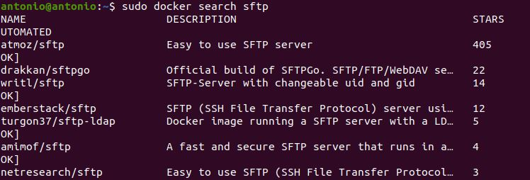
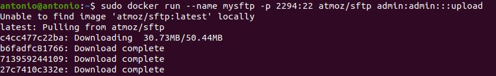
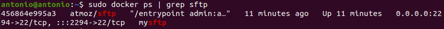
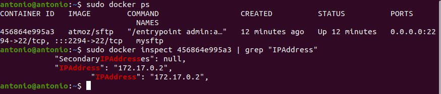
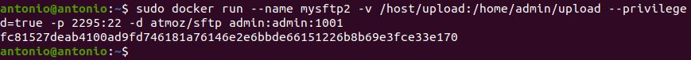
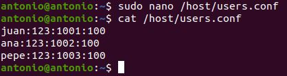
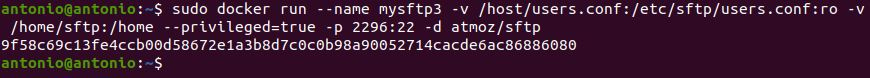

# Instalación Servidor FTP en Docker

## Índice
- <a href="#1">Buscar imagen</a>
- <a href="#2">Trabajar con la imagen</a>
- <a href="#3">Verificar la imagen</a>
- <a href="#4">Configurar el directorio home en la máquina host</a>
- <a href="#5">SFTP Multiusuario</a>


# <a name="1">Buscar imagen</a>

Ya existen muchas imágenes para la instalación de SFTP, podemos consultarlas ejecutando:

```
sudo docker search sftp
```



En esta ocasión elegiremos la desarrollada por **atmoz**.


# <a name="2">Trabajar con la imagen</a>

Para descargar y ejecutar esta imagen lanzaremos el comando:

```
sudo docker run –name mysftp -p 2294:22 -d atmoz/sftp admin:admin:::upload
```



Donde:
* name: Es el nombre del contenedor.
* admin:admin: Es el usuario y contraseña.


# <a name="3">Verificar la imagen</a>

Para comprobar la descarga de la imagen ejecutamos:

```
sudo docker ps | grep sftp
```


Lo siguiente será probar el acceso al servidor, por lo que ejecutaremos los siguientes comando para ver el ID del contenedor y para comprobar su IP.

```
sudo docker ps
sudo docker inspect ID | grep “IPAddress”
```




# <a name="4">Configurar el directorio home en la máquina host</a>

Para realizar la configuración ejecutaremos:

```
sudo docker run --name mysftp2 -v /host/upload:/home/admin/upload --privileged=true -p 2295:22 -d atmoz/sftp admin:admin:1001
```



Donde:
* **/home/upload:** Es el directorio del host
* **/home/admin/upload:** Donde se monta en el directorio del contenedor
* **--privileged =true:** Agregamos privilegios al contenedor
* **--name mysftp2:** Cambiamos el nombre puesto que no se puede repetir.


# <a name="5">SFTP Multiusuario</a>

Si queremos configurar varios usuarios hay dos maneras:

La primera sería crear los usuarios directamente en el contenedor y asignarle los permisos.

La segunda y la que emplearemos sería escribir los usuarios en un fichero en el host y montarlo en el contenedor.

Para ello crearemos el fichero de usuarios.



Y ejecutaremos el siguiente comando para montarlo:

```
sudo docker run --name mysftp3 -v /host/users.conf:/etc/sftp/users.conf:ro -v /home/sftp:/home --privileged=true -p 2296:22 -d atmoz/sftp
```



Donde:
* **-v /host/users.conf:/etc/sftp/users.conf:ro:** mapea el fichero local en la ruta /etc/sftp/users.conf del contenedor siendo de solo lectura.
* **-v /home/sftp:/home:** asigna el directorio local /home/sftp al del contenedor /home para almacenar los archivos cargados.
