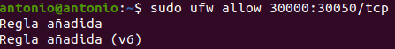

# Instalación de Servidor FTP

## Índice
- <a href="#1">Instalar el paquete vsftpd</a>
- <a href="#2">Verificar el servicio FTP</a>
- <a href="#3">Configurar el servidor FTP</a>


# <a name="1">Instalar el paquete vsftpd</a>

Lo primero será actualizar los repositorios:

```
sudo apt update &&sudo apt upgrade
```


Ejecutaremos el siguiente comando para instalar el paquete:

```
sudo apt install -y vsftpd
```


Y permitiremos el acceso a los puertos estándar en el firewall:

```
sudo ufw allow ftp
```


Y también el puerto de datos:

```
sudo ufw allow ftp-data
```


# <a name="2">Verificar el servicio FTP</a>

Podemos acceder desde un navegador usando la ruta ftp://IP, aunque con la configuración actual no debería funcionar, puesto que el modo pasivo esta deshabilitado.


Podemos probar accediendo desde un cliente como Filezilla, el cual descargaremos ejecutando:

```
sudo apt install filezilla
```


Y nos conectaremos especificando el servidor, usuario y contraseña.


# <a name="3">Configurar el servidor FTP</a>

Por defecto la configuración utiliza el modo activo, por lo que solo permitirá conexiones de clientes que no se encuentren tras un firewall y no intenten cambiar a modo pasivo automáticamente.

Para configurar el modo pasivo editaremos el fichero **/etc/vsftpd.conf** añadiendo al final del fichero las siguientes lineas.


Y recargaremos la configuración del servicio.


Así como también añadiremos el rango de puertos al firewall.



Ahora realizaremos la verificación de acceso a través de filezilla y desde la terminal.


Desde filezilla solo me permite acceder si no especifico puerto.


Por defecto FTP trabaja con usuarios del sistema, podemos desactivarlo para acceder con usuarios anónimos cambiando **local_enable=YES** a **NO**, pero si lo mantenemos podemos configurar algunas otras cosas.

Descomentando **write_enable** los usuarios podrán crear o eliminar archivos y directorios.


También podemos evitar que los usuarios puedan navegar por todo el sistema de archivos y solo puedan acceder a sus directorios personales, esto lo haremos descomentando **chroot_local_user** y añadimos la siguiente directiva para no tener que cambiar los permisos de estos directorios.


