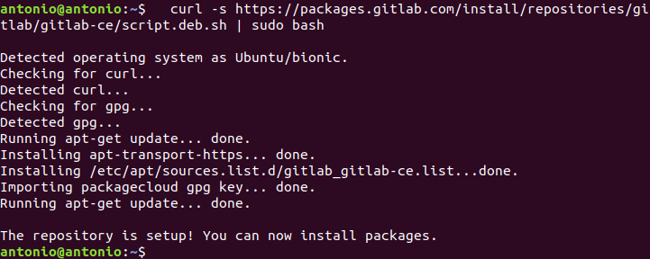

# Instalación GitLab

## Índice
- <a href="#1">Requisitos previos</a>
- <a href="#2">Pasos para la instalación en local</a>
-- <a href="#3">Actualización de los repositorios</a>
-- <a href="#4">Instalación de paquetes adicionales</a>
-- <a href="#5">Instalación de GitLab</a>
-- <a href="#6">Acceso</a>


# <a name="1">Requisitos previos</a>

Esta guía esta destinada a la instalación de Git en una máquina Linux, la distribución que se muestra en el ejemplo es Ubuntu.

Será necesario tener una cuenta de superusuario no root.

# <a name="2">Pasos para la instalación en local</a>

## <a name="3">Actualización de los repositorios</a>

Antes de cualquier instalación es recomendable actualizar tanto los repositorios como el sistema, por lo que ejecutaremos el siguiente comando:
```
sudo apt update && sudo apt upgrade
```


## <a name="4">Instalación de paquetes adicionales</a>

GitLab necesita de algunos paquetes adicionales, por lo que procederemos a instalarlos, esto lo haremos ejecutando:
```
sudo apt install y vim curl cacertificates apt-transport-https
```


## <a name="5">Instalación de GitLab</a>

Lo primero será descargar el script proporcionado por Gitlab, el cual nos configura el repositorio APT del sistema y nos instala las dependencias, para ello utilizaremos el comando:

```
curl -s  https://packages.gitlab.com/install/repositories/gitlab/gitlab-ce/script.deb.sh | sudo bash
```



Cuando finalice ejecutaremos el siguiente comando para proceder con la instalación:

```
sudo apt install gitlab-ce
```


Cuando nos salga un mensaje similar a este habrá terminado.


Por último debemos terminar de configurar Gitlab, para ello lanzamos el comando:

```
sudo gitlab-ctl reconfigure
```


## <a name="6">Acceso</a>

Si hemos terminado la instalación podemos acceder utilizando un navegador, en el pondremos la IP del servidor en el que tengamos Gitlab instalado.

Para saber la IP de la máquina podemos ejecutar ifconfig para luego introducirla en la barra de direcciones, por ejemplo http://172.19.99.95/.


Para logearnos lo haremos con el usuario root y la contraseña que encontraremos en **/etc/gitlab/initial_root_password**.


Si tenemos algún problema podemos o queremos cambiar la contraseña de root ejecutaremos el siguiente comando para abrir una consola Rails con Ruby.

````
gitlab-rails console
````


Hay varias formas de buscar usuarios, pero la mas sencilla de buscar al root es ejecutando:

````
user = User.where(id: 1).first
````


Para cambiar la contraseña solo debemos ejecutar los siguientes comandos:

````
user.password = 'contraseña'
user.password_confirmation = 'contraseña'
````


