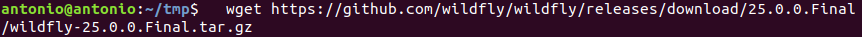

# Instalación de Jboss-WildFly

## Índice
- <a href="#1">Requisitos previos</a>
- <a href="#2">Pasos para realizar la instalación en local</a>
- <a href="#3">Actualización de los repositorios</a>
- <a href="#4">Instalación de WildFly</a>
- <a href="#5">Configurar Wildfly</a>
- <a href="#6">Acceso a Wildfly</a>
- <a href="#7">Cómo añadir usuarios a WildFly</a>
- <a href="#8">Gestionar la consola de forma remota</a>


# <a name="1">Requisitos previos</a>

Necesitaremos tener un servidor **Ubuntu** con **JAVA** y **MAVEN** instalado.

# <a name="2">Pasos para realizar la instalación en local</a>


## <a name="3">Actualización de los repositorios</a>

Antes de realizar cualquier instalación es recomendable actualizar tanto los repositorios como el sistema, para ello ejecutaremos:

```
sudo apt update && sudo apt upgrade
```


## <a name="4">Instalación de WildFly</a>

Descargaremos la última versión de Wildfly desde su sitio oficial, donde encontraremos varios paquetes en formato tar.gz que podemos descargar directamente desde la consola con **wget**:

```
wget https://github.com/wildfly/wildfly/releases/download/25.0.0.Final/wildfly-25.0.0.Final.tar.gz
```



Vamos a preparar nuestro sistema para instalar Wildfly como u servicio que corra utilizando su propio usuario y grupo, por lo que debemos:

* Crear el grupo y usuario:

```
sudo groupadd -r wildfly
sudo useradd -r -g wildfly -d /opt/wildfly -s /sbin/nologin wildfly
```


* Descomprimir el paquete y moverlo a su ubicación definitiva:

```
tar -xvzf wildfly-25.0.0.Final.tar.gz
sudo mv wildfly-25.0.0.Final /opt/wildfly-25.0.0.Final
```


* Crear un enlace simbólico al directorio para evitar el nombre con versión:

```
sudo ln -s /opt/wildfly-25.0.0.Final /opt/wildfly
```


* Dar acceso al usuario y grupo creados:

```
sudo chown -R wildfly:wildfly /opt/wildfly
```


Puede que este comando falle y no conceda los permisos a las carpetas contenidas dentro, por lo que deberíamos lanzarlo con una barra al final:

```
sudo chown -R wildfly:wildfly  /opt/wildfly/
```


* Configurar e iniciar el servicio:

```
sudo mkdir -p etcwildfly
sudo cp /opt/wildfly/docs/contrib/scripts/systemd/wildfly.conf /etc/wildfly/
```


Podemos consultar el fichero de configuración de arranque para comprobar que por defecto se encuentra en **standalone**:

```
sudo cat /etc/wildfly/wildfly.conf
```


Y lanzar los siguientes comandos para configurar el arranque:

```
sudo cp /opt/wildfly/docs/contrib/scripts/systemd/launch.sh /opt/wildfly/bin/

sudo sh -c ‘chmod +x /opt/wildfly/bin/*.sh’

sudo cp /opt/wildfly/docs/contrib/scripts/systemd/wildfly.service /etc/systemd/system/

sudo systemctl daemon-reload
```


* Iniciar el servicio:

```
sudo systemctl start wildfly
```


* Verificar el estado del servicio:

```
sudo systemctl status wildfly
```


* Configurar el inicio automático con el sistema:

```
sudo systemctl enable wildfly
```


## <a name="5">Configurar Wildfly</a>

Wildfly tiene asignado por defecto el puerto de acceso 8080, como lo tenemos ocupado con otros servicios debemos modificarlo en el fichero:

```
sudo nano /opt/wildfly/standalone/configuration/standalone.xml
```


Y modificar la siguiente linea:


Por el puerto 8083 en mi caso:


Y aunque en algunas distribuciones no es estrictamente necesario, permitimos el tráfico en el puerto:

```
sudo ufw allow 8083/tcp
```


## <a name="6">Acceso a Wildfly</a>

Si hemos configurado todo correctamente, podremos acceder a Wildfly fácilmente a través del puerto asignado:

```
http://IP:PORT o http://localhost:PORT
```


# <a name="7">Cómo añadir usuarios a WildFly</a>

Vamos a añadir un usuario con capacidad de administración para no utilizar el administrador, para ello ejecutamos el entorno interactivo con:

```
sudo /opt/wildfly/bin/add-user.sh
```


Elegimos la opción (a) para crear un usuario administrador, le asignamos una contraseña, y simplemente continuamos con el resto de opciones por defecto.


# <a name="8">Gestionar la consola de forma remota</a>

Para esto tenemos que modificar el fichero **/etc/wildfly/wildfly.conf**  y añadir la siguiente linea:

```
WILDFLY_CONSOLE_BIND=0.0.0.0
```


Y modificamos el fichero **/opt/wildfly/bin/launch.sh** de la siguiente manera:


Ahora debemos reiniciar el servicio y modificar el fichero **/etc/systemd/system/wildfly.service** añadiendo **$WILDFLY_CONSOLE_BIND** al final de la linea **ExecStart**:

```
sudo systemctl restart wildfly
sudo nano / etc/systemd/system/wildfly.service
```


Por último reiniciamos el daemon y el servicio:

```
sudo systemctl daemon-reload
sudo systemctl restart wildfly
```


Si ahora accedemos a través del navegador, podemos ir al apartado de la consola de administración y acceder con nuestro usuario:


