# Instalación de Jenkins en Docker

## Índice
- <a href="#1">Dominio Apache</a>
- <a href="#2">Instalación de Jenkins en Docker</a>
- <a href="#3">Instalación de Jenkins con Docker y Docker-Compose</a>
- <a href="#4">Dockerfile</a>
- <a href="#5">Plugins.txt</a>
- <a href="#6">Docker-compose.yml</a>
- <a href="#7">Construcción de la imagen</a>


# <a name="1">Dominio Apache</a>

Lo primero será crear un dominio que nos permita acceder al servicio, para esto crearemos un nuevo fichero de configuración en **/etc/apache2/sites-available**.

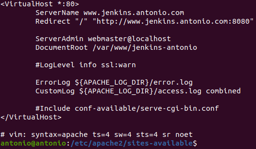

Luego crearemos el enlace simbólico y reiniciaremos apache.


# <a name="2">Instalación de Jenkins en Docker</a>

Debemos descargar la imagen de Jenkins, podemos consultar el Hub de Docker para elegir la deseada, una vez hecho ejecutamos el siguiente comando con la versión elegida:

```
sudo docker pull jenkins/jenkins:lts
```

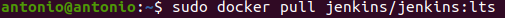

Y verificamos que se ha descargado correctamente:

```
sudo docker images
```

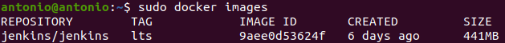

Por último ejecutaremos un contenedor utilizando la imagen:

```
docker run -p 8080:8080 -p 50000:50000 -v /your/home:/var/jenkins_home jenkins/jenkins:lts
```

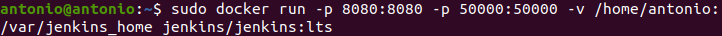

Si todo ha funcionado correctamente, debemos poder acceder desde el navegador.

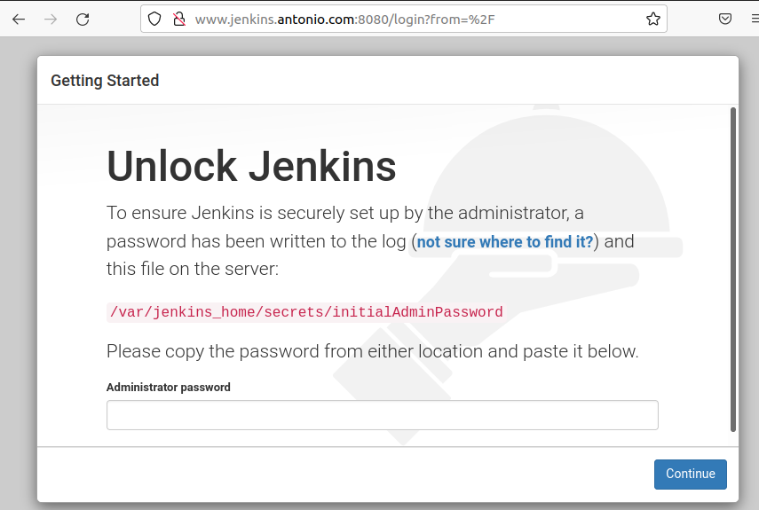


# <a name="3">Instalación de Jenkins con Docker y Docker-Compose</a>

Debemos crear un directorio que contenga los ficheros que vamos a crear.


# <a name="4">Dockerfile</a>

Lo primero será el fichero Dockerfile que contiene las instrucciones para construir la imagen.

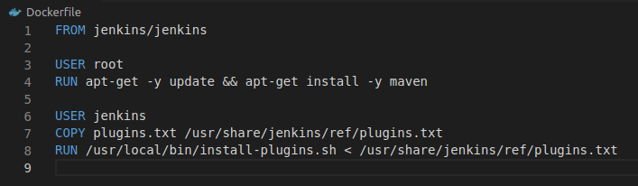

Aquí especificamos el nombre de la imagen que utilizaremos, la instalación de maven y la copia del fichero de plugins.


# <a name="5">Plugins.txt</a>

Este fichero contendrá los plugins que queremos instalar en Jenkins, de manera que quede un plugin por linea.

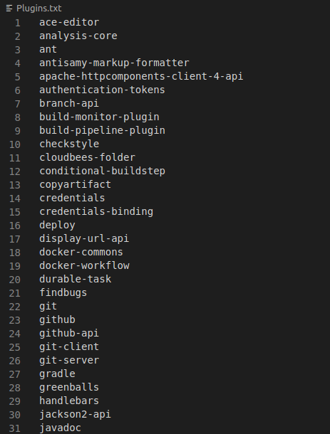


# <a name="6">Docker-compose.yml</a>

Este fichero especifica la configuración de nuestro Jenkins.

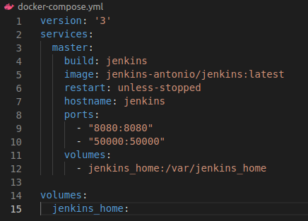

Aquí especificamos el directorio sobre el que se construye la imagen, su nombre, el hostname, puertos y volumen entre otras cosas.

Finalmente la estructura de ficheros quedará de la siguiente forma.

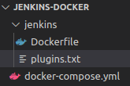


# <a name="7">Construcción de la imagen</a>

Para construir la imagen ejecutamos:

```
sudo docker-compose build
```

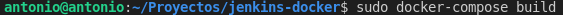

Una vez finalizada arrancaremos el contenedor ejecutando:

```
sudo docker-compose up -d
```

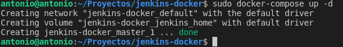

Una vez termine el contenedor estará en funcionamiento y podremos acceder desde el navegador, pero primero consultaremos la clave de administrador necesaria para la configuración ejecutando:

```
sudo docker exec -it dockerjenkins_master_1 cat /var/jenkins_home/secrets/initialAdminPassword
```

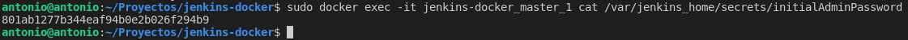

Con esto ya podremos configurar Jenkins a nuestro gusto.

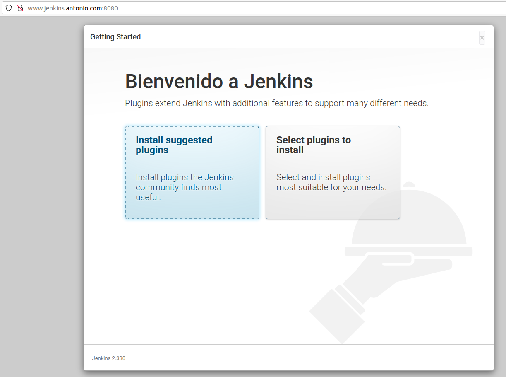
