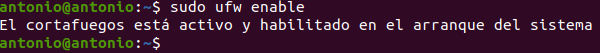
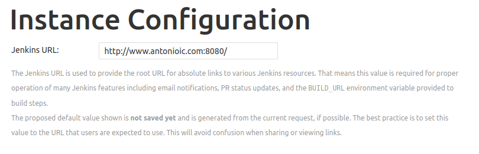

# Instalación Jenkins

## Índice
- <a href="#1">Dominio Apache</a>
- <a href="#2">Instalación Jenkins</a>
- <a href="#3">Iniciar Jenkins</a>
- <a href="#4">Abrir firewall</a>
- <a href="#5">Configuración Jenkins</a>


# <a name="1">Dominio Apache</a>

Lo primero que haremos será crear un dominio por el cual accederemos a la herramienta durante y tras su instalación y configuración. Este se llamara en mi caso **www.antonioic.com**.


Después de crear el dominio crearemos un enlace simbólico en la carpeta **/etc/apache2/sites-enabled**.


# <a name="2">Instalación Jenkins</a>

Agregamos la clave del repositorio al sistema:

```
wget -q -O - https://pkg.jenkins.io/debian-stable/jenkins.io.key | sudo apt-key add
```


Si el resultado en **OK**, procedemos a anexar la dirección del repositorio de paquetes a source.list del servidor:

```
sudo sh -c 'echo deb http://pkg.jenkins.io/debian-stable binary/ > /etc/apt/sources.list.d/jenkins.list'
```


Ahora actualizaremos los repositorios del sistema:

```
sudo apt update
```


Y procedemos a instalar **Jenkins**:

```
sudo apt install jenkins
```


# <a name="3">Iniciar Jenkins</a>

Iniciamos el servicio:

```
sudo systemctl start jenkins
```


Y comprobamos el estado del servicio:

```
sudo systemctl status jenkins
```


# <a name="4">Abrir firewall</a>

Permitimos el puerto 8080 en el firewall UFW:

```
sudo ufw allow 8080
```


En caso de que tengamos el firewall desactivado, ejecutaremos los siguientes comandos para habilitarlos y permitir OenSSH:

```
sudo ufw allow OpenSSH
sudo ufw enable
```




Y comprobamos el estado del firewall:

```
sudo ufw status
```


# <a name="5">Configuración Jenkins</a>

Ahora que ya tenemos el servicio instalado y funcionando, accedemos desde el navegador utilizando el dominio que hemos creado.


Para acceder necesitamos la contraseña de administrador que podemos consultar en el siguiente fichero:

```
sudo cat /var/lib/jenkins/secrets/initialAdminPassword
```


La pegamos en el campo y accederemos a la instalación de complementos, donde seleccionaremos **Install suggested plugins**.


Y esperamos a que se complete el proceso de instalación


Al terminar nos pedirá configurar el primer usuario administrador del sistema, paso que podemos saltar y seguir empleando la contraseña anteriormente mencionada, pero que no haremos y configuraremos.


En la siguiente pantalla nos pedirá confirmar la URL para instanciar Jenkins.



Hecho esto habremos acabado la configuración.


Si hacemos clic en **Start using Jenkins** nos llevará al panel principal de Jenkins.


