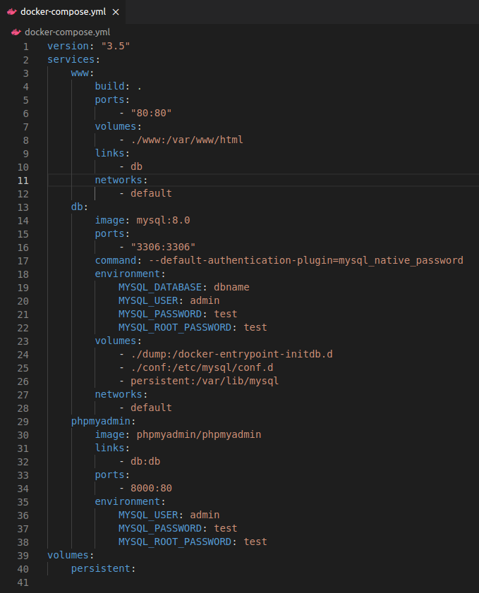
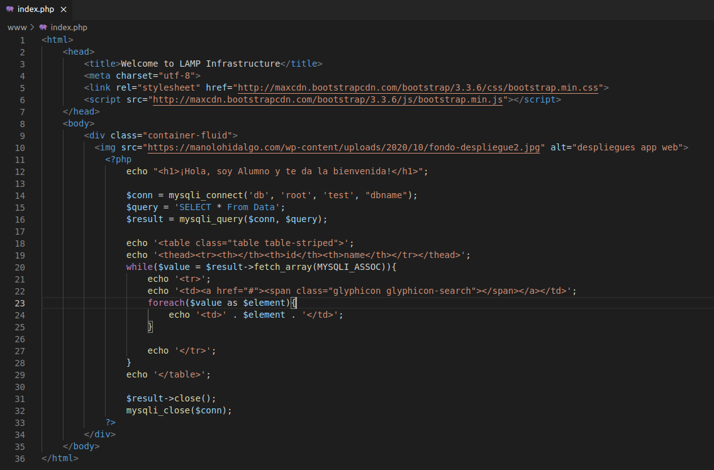

# Instalación LAMP en Docker

## Índice
- <a href="#1">Pila LAMP</a>
- <a href="#2">Diagrama Docker</a>


# <a name="1">Pila LAMP</a>

Una pila es un conjunto de servicios o paquetes instalables y que se relacionan entre sí.

Utilizaremos Docker por la contenerización, creando un ambiente donde las aplicaciones eviten fallos por temas de dependencias.

La infraestructura que crearemos será la siguiente:


# <a name="2">Diagrama Docker</a>

Tendremos 3 contenedores que conforman un sistema distribuido interconectados entre sí, cada uno con servicios distintos que constituyeran la pila LAMP en la red local.

**Servidor web:**
* Nombre: **www**
* Puerto: **80**

**Servidor de base de datos:**
* Nombre: **db**
* Puerto: **3306**

**Servidor del sistema gestor de base de datos gráfico:**
* Nombre: **phpmyadmin**
* Puerto: **8000**

La estructura del proyecto es la siguiente:


En el fichero **Dockerfile** especificaremos la instalación de la versión **8.0.0** de **php** con **apache**. También modificaremos la variable de entorno DEBIAN_FRONTES a modo no interactivo e instalaremos algunas extensiones de comunicación y actualizaciones de repositorio.


En el fichero **docker-compose.yml** definiremos los servicios **www**, **db** y **phpmyadmin**.



En **dbname.sql** tendremos el siguiente contenido que se exporta a MySQL.


Y en **index.php** la siguiente página de prueba, que comprueba la correcta carga del sitio y su conectividad con la base de datos.



Ya solo tendremos que lanzar la configuración ejecutando:

```
sudo docker-compose up -d
```


Y comprobar si los 3 contenedores funcionan correctamente ejecutando.

```
sudo docker-compose ps
```


Si accedemos desde el navegador deberíamos poder observar la siguiente web.


También podemos comprobar el acceso a **phpmyadmin** accediendo desde el puerto **8000** con las credenciales especificadas en **docker-compose.yml**.


Cualquier aplicación que queramos desplegar debemos colocarla dentro de **www** y acceder a ella desde la ruta **IP/app** o **localhost/app**.


Finalmente para detener el stack con Docker compose debemos ejecutar:

```
sudo docker-compose stop
```


