# Instalación Nginx

## Índice
- <a href="#1">Requisitos previos</a>
- <a href="#2">Instalar Nginx</a>
- <a href="#3">Ajustes de firewall</a>
- <a href="#4">Configurar bloques de servidor</a>
- <a href="#5">Comprobar su servidor web</a>


# <a name="1">Requisitos previos</a>

Necesitaremos tener un servidor **Ubuntu** y un usuario no root con privilegios de sudo.

# <a name="2">Instalar Nginx</a>

Antes de realizar cualquier instalación es recomendable actualizar nuestro índice local de paquetes:

```
sudo apt update
```

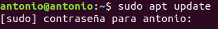

Ya que Nginx está disponible en los repositorios de Ubuntu, podemos instalarlo ejecutando:

```
sudo apt install nginx
```

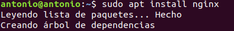


# <a name="3">Ajustes de firewall</a>

Lo primero que debemos hacer tras la instalación es permitir el acceso al servicio en el firewall, para ello listaremos las aplicaciones con las que **ufw** sabe trabajar con:

```
sudo ufw app list
```

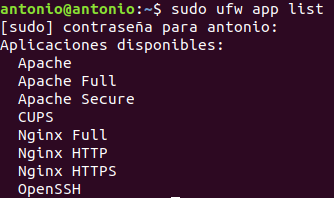

Ya que solamente utilizaremos el puerto “80” u 84 en nuestro caso pues lo cambiaremos más adelante, habilitaremos **Nginx HTTP**:

```
sudo ufw allow 'Nginx HTTP'
```

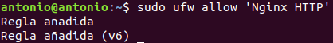

Podemos verificarlo consultando las excepciones con:

```
sudo ufw status
```

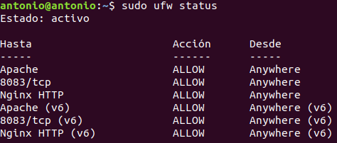


# <a name="4">Configurar bloques de servidor</a>

Los bloques de servidor nos permiten encapsular los detalles de la configuración y alojar más de un dominio en el mismo servidor, por lo que configuraremos un dominio **your_domain**, siendo el primer paso crear su directorio:

```
sudo mkdir -p /var/www/your_domain/html
```

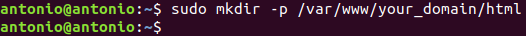

Y asignamos con la variable **$USER** el propietario:

```
sudo chown -R $USER:$USER /var/www/your_domain/html
```

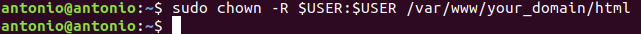

Y ejecutamos el siguiente comando para asegurarnos unos permisos correctos:

```
sudo chmod -R 755 /var/www/your_domain
```

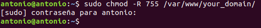

Y creamos un index.html de ejemplo:

```
sudo nano /var/www/your_domain/html/index.html
```

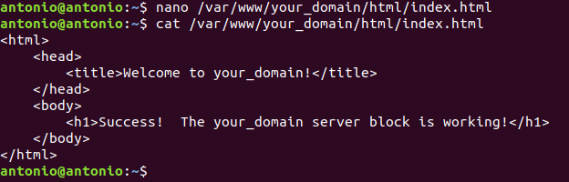

Creamos un nuevo archivo de configuración para nuestro dominio donde especificaremos también el puerto que utilizaremos:

```
sudo nano /etc/nginx/sites-available/your_domain
```

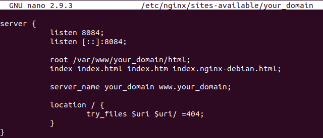

Habilitamos el archivo creando un enlace simbólico en **sites-enabled**:

```
sudo ln -s /etc/nginx/sites-available/your_domain /etc/nginx/sites-enabled/
```

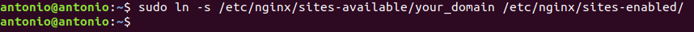

Modificamos el fichero **/etc/nginx/nginx.conf** y descomentamos la linea **#server_names_hash_bucket_size** para evitar un problema de memoria que pueda surgir al agregar nombres de servidor:

```
sudo nano /etc/nginx/nginx.conf
```

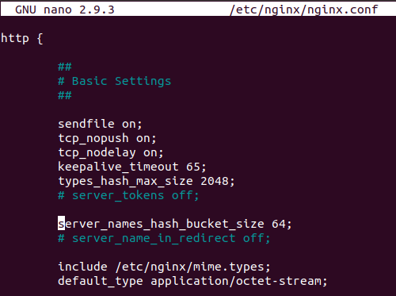

Comprobamos que los archivos de Nginx no tengan errores de sintaxis:

```
sudo nginx -t
```

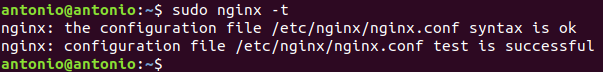

Y reiniciamos el servicio de Nginx:

```
sudo systemctl restart nginx
```

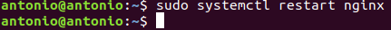


# <a name="5">Comprobar su servidor web</a>

Ejecutamos el siguiente comando para comprobar el estado del servicio:

```
sudo systemctl status nginx
```

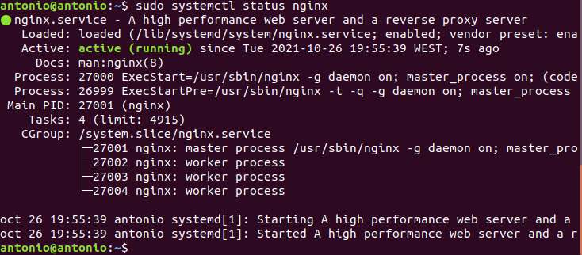

Si accedemos desde el navegador comprobaremos que se muestra nuestra página.


Por último podemos modificar el archivo **/etc/hosts** para acceder con el nombre de dominio:

```
sudo nano /etc/hosts
```

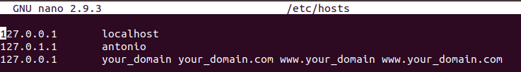

Y ahora podemos acceder desde cualquiera de estos nombres.


