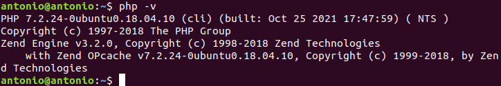

# Instalación PHP

## Índice
- <a href="#1">Requisitos previos</a>
- <a href="#2">PHP para Apache</a>
- <a href="#3">PHP para Nginx</a>
- <a href="#4">Probar PHP</a>
- <a href="#5">Configuración de subdominios</a>


# <a name="1">Requisitos previos</a>

Necesitaremos tener un servidor **Ubuntu** y usuario no root con privilegios de sudo.

Es recomendable también actualizar los repositorios antes de instalar cualquier paquete:

```
sudo apt update
```


# <a name="2">PHP para Apache</a>

Si queremos instalar php para apache, necesitamos el paquete **libapache2-mod-php**:

```
sudo apt install -y php
```


# <a name="3">PHP para Nginx</a>

Si lo queremos instalar para Nginx, necesitamos el paquete **php-fpm**:

```
sudo apt install -y php-fpm
```


PHP se instala como servicio independiente y queda iniciado y habilitado por defecto en el sistema.

Para saber la versión de PHP que hemos instalado ejecutaremos:

```
php -v
```



Debemos editar el archivo de configuración de Nginx para conectar con el servicio **php-fpm**:

```
sudo nano /etc/nginx/sites-available/default
```


Y recargar la configuración:

```
sudo systemctl reload nginx
```


# <a name="4">Probar PHP</a>

Debemos crear un fichero accesible vía web:

```
sudo nano /var/www/html/info.php
```


Y acceder a el desde el navegador.


# <a name="5">Configuración de subdominios</a>

Debemos copiar la página que hemos creado a la carpeta del subdominio creada anteriormente:


Y aplicar la misma configuración al archivo de configuración del subdominio que hemos aplicado al archivo **default** de Nginx.


Y ya podríamos acceder desde el navegador con la ruta del subdominio.


