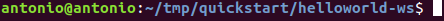

# Instalación de servicios REST/WS WildFly

## Índice
- <a href="#1">Requisitos previos</a>
- <a href="#2">Pasos para realizar la instalación de los servicios</a>
- <a href="#3">Descarga de los ejemplos</a>
- <a href="#4">Instalación de Servicio HelloWorld-RS</a>
- <a href="#5">Instalación de Servicio HelloWorld-WS</a>


# <a name="1">Requisitos previos</a>

Necesitaremos tener un servidor **Ubuntu** con **JAVA** y **MAVEN** instalado.

También debemos tener desplegado un servidor de aplicaciones **WildFly**.

# <a name="2">Pasos para realizar la instalación de los servicios</a>


## <a name="3">Descarga de los ejemplos</a>

Para realizar este ejemplo debemos descargar el repositorio: https://github.com/wildfly/quickstart/


## <a name="4">Instalación de Servicio HelloWorld-RS</a>

Dentro del repositorio localizamos la carpeta **helloworld-rs**, accedemos a ella y compilamos el proyecto ejecutando:

```
mvn clean install
```


Localizamos el **.war** generado en al directorio y lo arrastramos (o localizamos pulsando +) al apartado **Deployments**.


Una vez hecho podemos comprobar que el servicio se ha desplegado correctamente.


Y accederemos a el a través de la ruta **http://IP:Puerto/helloword-rs/**


## <a name="5">Instalación de Servicio HelloWorld-WS</a>

Dentro del repositorio localizamos la carpeta **helloworld-rs**, accedemos a ella y compilamos el proyecto ejecutando:

```
mvn clean install
```




Localizamos el **.war** generado en al directorio y lo añadimos también en el apartado **Deployments**.


Y de igual manera accedemos para comprobar a través de **http://IP:Puerto/helloword-ws/**


