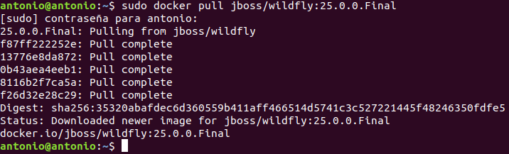
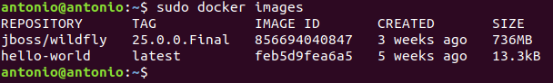
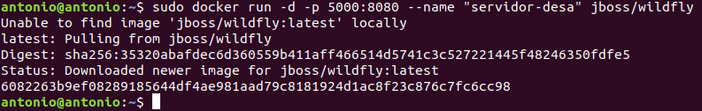
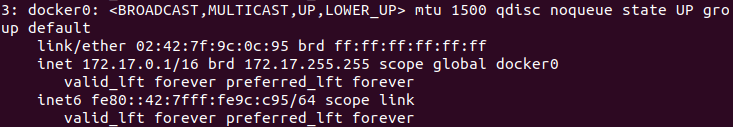
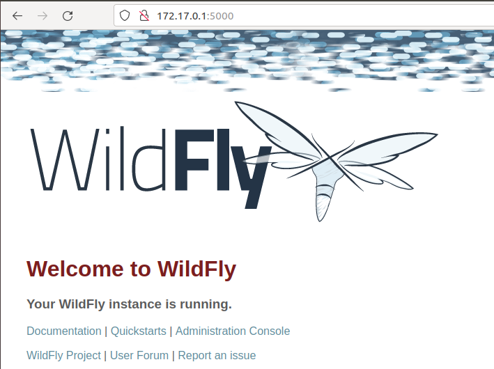

# Instalación de Wildfly en Docker

## Índice
- <a href="#1">Descargar imagen del docker Wildfly</a>


# <a name="1">Descargar imagen del docker Wildfly</a>

Si construimos directamente nos descargará la imagen base que necesite, pero nosotros descargaremos un versión específica de Wildfly, la **25.0.0.Final**, por lo que ejecutaremos:

```
sudo docker pull jboss/wildfly:25.0.0.Final
```



Y consultamos el listado de imágenes descargadas:

```
sudo docker images
```



Lo siguiente es arrancar un contenedor con esa imagen:

```
sudo docker run -d -p 5000:8080 --name "servidor-desa" jboss/wildfly
```

* **-d** (daemon) → arranca el servidor en background

* **-p 5000:8080** → publica el puerto 8080 de Wildfly al puerto 5000 del host

* **--name “servidor-desa”** → define un alias para el contenedores

* **jboss/wildfly** → imagen a arrancar



Si ejecutamos el comando **ip a** podemos ver que docker a creado una nueva red.



Si accedemos a través de esa IP al puerto **5000** podemos comprobar la instalación:

```
172.17.0.1:5000
```


