# Manipulación avanzada de repositorios en Git

## Índice
- <a href="#1">Ejercicio 1</a>
- <a href="#2">Ejercicio 2</a>
- <a href="#3">Ejercicio 3</a>
- <a href="#4">Ejercicio 4</a>
- <a href="#5">Ejercicio 5</a>
- <a href="#6">Ejercicio 6</a>
- <a href="#7">Ejercicio 7</a>
- <a href="#8">Ejercicio 8</a>
- <a href="#9">Ejercicio 9</a>


## <a name="1">Ejercicio 1</a>

Para mostrar el historial de cambios del repositorio ejecutaremos el comando **git log**.

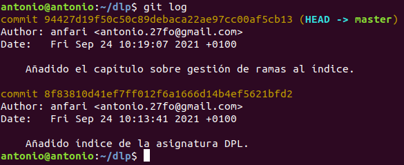

Creamos la carpeta **capítulos** y dentro de ella el fichero **capitulo1.txt** con el contenido:</br>
>*Git es un sistema de control de versiones ideado por Linus Torvalds.*

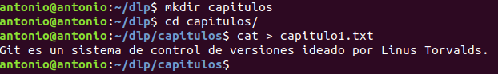

Añadimos los cambios a la zona de intercambio temporal.

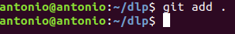

Realizamos un commit con el mensaje **Añadido capítulo 1.**

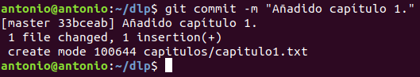

Volvemos a mostrar el historial de cambios.

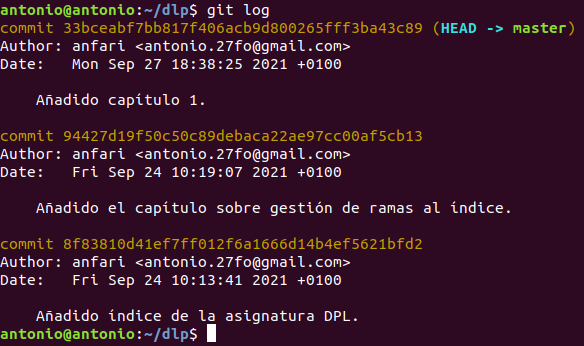


## <a name="2">Ejercicio 2</a>

Creamos el fichero **capitulo2.txt** en la carpeta capítulos con el contenido:</br>
>*El flujo de trabajo básico con Git consiste en:* </br>
*1- Hacer cambios en el repositorio.* </br>
*2- Añadir los cambios a la zona de intercambio temporal.* </br>
*3- Hacer un commit de los cambios.*

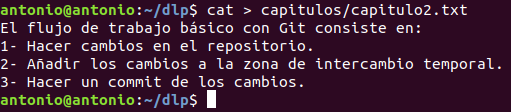

Añadimos los cambios a la zona de intercambio temporal y hacemos un commit de los cambios con el mensaje **Añadido capítulo 2.**

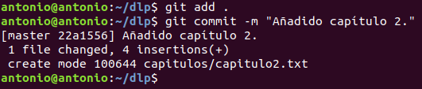

Mostramos las diferencias entre esta versión y las dos anteriores, para ello ejecutamos el comando:
````
git diff HEAD~2..HEAD
````

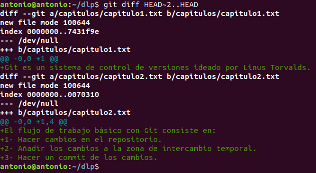


## <a name="3">Ejercicio 3</a>

Creamos el fichero **capitulo3.txt** en la carpeta capítulos con el contenido:
>Git permite la creación de ramas lo que permite tener distintas versiones del mismo proyecto y trabajar de manera simultanea en ellas.


Añadimos los cambios a la zona de intercambio temporal y realizamos un commit con el mensaje **Añadido capítulo 3.**


Mostramos las diferencias entre la primera y la última versión del repositorio, para ello ejecutamos primero el comando:
````
git log
````


Copiamos el identificador del primer commit y ejecutamos el comando:
````
git diff commit..HEAD
````


## <a name="4">Ejercicio 4</a>

Creamos el fichero **índice.txt** con el contenido:
>Indice de los capítulos, con conceptos avanzados de git


Añadimos los cambios a la zona de intercambio temporal y realizamos un commit con el mensaje **Se crea el índice.**


Mostramos quien ha hecho los cambios ejecutando el comando:
````
git annotate idice.txt
````


## <a name="5">Ejercicio 5</a>

Creamos una nueva rama con el nombre **bibliografía**.


Y mostramos todas las ramas del repositorio ejecutando:
````
git branch -av
````


## <a name="6">Ejercicio 6</a>

Creamos el fichero **capitulo4.txt** en la carpeta capítulos con el contenido:
>En este capítulo veremos cómo usar GitHub para alojar repositorios en remoto.

Y añadimos los cambios a la zona de intercambio temporal y realizamos el commit con el mensaje **Añadido capítulo 4.**


Mostramos la historia del repositorio incluyendo todas las ramas, para ello ejecutamos:
````
git log –graph –all –oneline
````


## <a name="7">Ejercicio 7</a>

Cambiamos a la rama bibliografía.


Creamos el fichero **bibliografia.txt** con el contenido:
>Chacon, S. and Straub, B. Pro Git. Apress.


Añadimos los cambios a la zona de intercambio temporal y realizamos un commit con el mensaje **Añadida primera referencia bibliográfica.**


Mostramos la historia del repositorio incluyendo todas las ramas.


## <a name="8">Ejercicio 8</a>

Fusionamos la rama **bibliografía** con la rama **master**.


Mostramos la historia del repositorio incluyendo todas las ramas.


Eliminamos la rama bibliografía, para ello ejecutamos:
````
git branch -d bibliografia
````

Y mostramos de nuevo la historia.


## <a name="9">Ejercicio 9</a>

Creamos nuevamente la rama **bibliografía** y cambiamos a ella.


Modificamos el fichero **bibliografía.txt** para que contenga:</br>
>Scott Chacon and Ben Straub. Pro Git. Apress.</br>
Ryan Hodson. Ry’s Git Tutorial. Smashwords (2014)</br>
Y realizamos un commit con el comentario Añadida nueva referencia bibliográfica.


Cambiamos a la rama **master** y modificamos el fichero **bibliografia.txt** para que contenga:</br>
>Chacon, S. and Straub, B. Pro Git. Apress.</br>
Loeliger, J. and McCullough, M. Version control with Git. O’Reilly.</br>
Y realizamos un commit con el comentario Añadida nueva referencia bibliográfica.


**Fusionamos** la rama **bibliografía** con la rama **master**.


Resolvemos el conflicto editando el fichero **bibliografia.txt** dejando solo la última modificación.

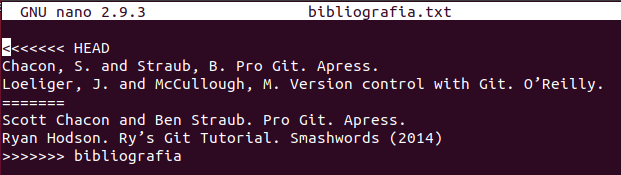

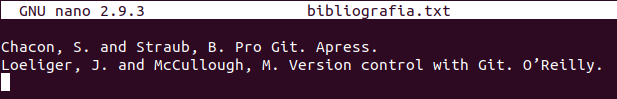

Añadimos los cambios a la zona de intercambio temporal y realizamos un commit con el mensaje **Resuelto conflicto de bibliografía.**

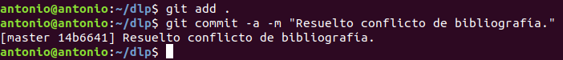

Y mostramos el historial del repositorio.

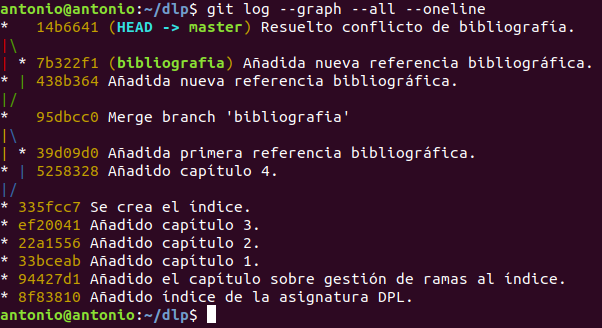
