# Manipulación de repositorios en Git

## Requisitos previos

Se necesita de una distribución Linux con Git instalado y configurado.

## Configuración

Lo básico para configurar Git es definir tu nombre de usuario, correo electrónico y activar el coloreado de salida, esto lo haremos ejecutando los comandos:
````
git config --global user.name “nombre”
git config --global user.email “correo-electrónico”
git config --global color.ui auto
````

Dado que en la práctica anterior ya configuramos los dos primeros, solo ejecutaremos el último comando mostrado, para ver la configuración actual, utilizamos el comando:
````
git config --list
````
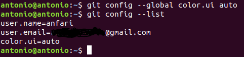


## Creación de un repositorio

Lo primero será crear la carpeta con el nombre del repositorio deseado, una vez hecho nos movemos dentro de la misma y ejecutamos **git init** para inicializar el repositorio, si comprobamos el contenido de la carpeta, veremos que se ha creado el fichero *.git*.

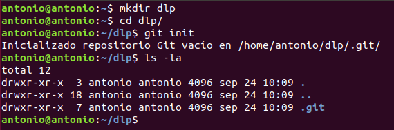


## Comprobar el estado del repositorio

Primero comprobaremos el estado del repositorio con el comando:
````
git status
````
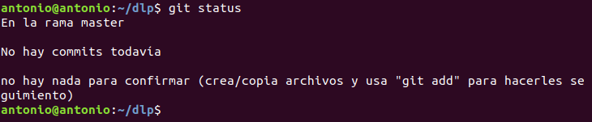

Ahora crearemos un fichero llamado **indice.txt** con el siguiente contenido.

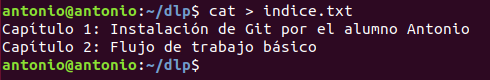

Y comprobamos de nuevo el estado.

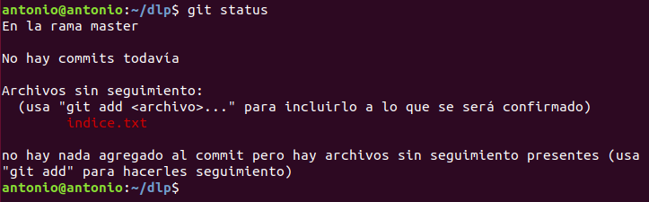

Como podemos ver se han actualizado los cambios y nos avisa con rojo que el fichero no tiene seguimiento, por lo que procedemos a añadirlo.

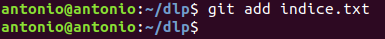

Y comprobamos de nuevo el estado para ver que haya funcionado correctamente.

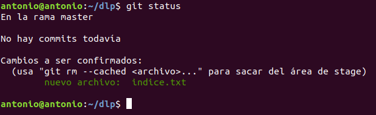


## Realizando Commit's

Tenemos que realizar un commit con los últimos cambios que hemos hecho para no perderlos y que se guarden en el servidor, para ello ejecutamos:
````
git commit -m “Añadido índice de la asignatura DPL.”
````
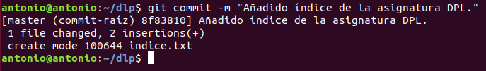

Y comprobamos que el estado del repositorio está limpio.

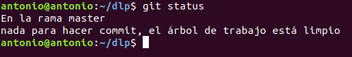


## Modificación de ficheros

Para este punto modificaremos el fichero **indice.txt** añadiéndole algunas lineas.


Para consultar las diferencias entre nuestro fichero y la última versión guardada utilizamos:
````
git diff
````
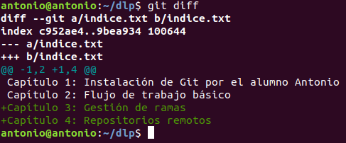

Tras ver que no está actualizado añadimos de nuevo el archivo y generamos un nuevo commit.

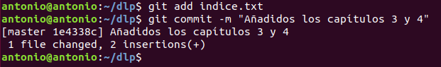


## Historial

El comando **git show** nos permite ver los cambios entre las dos últimas versiones del repositorio.

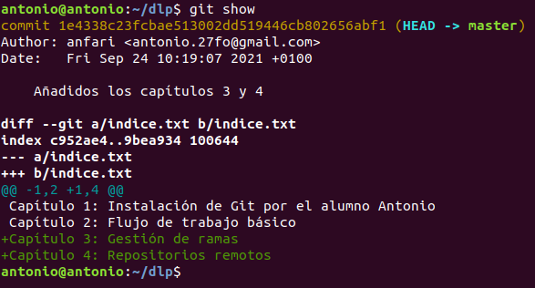

Podemos cambiar el mensaje de nuestro último commit y volver a consultarlo, para apreciar que la versión es la misma, pues solo hemos cambiado el mensaje del commit.

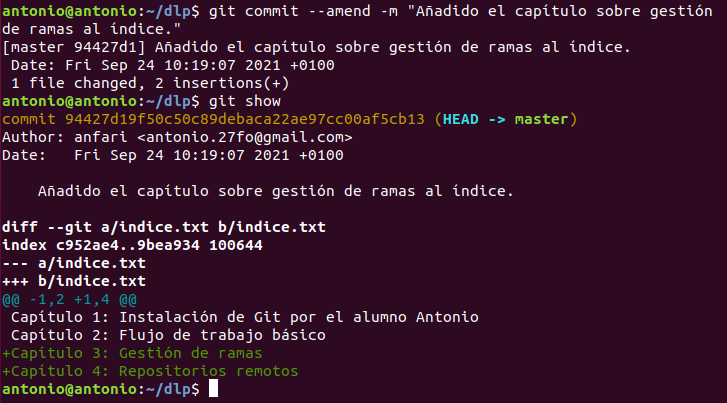
