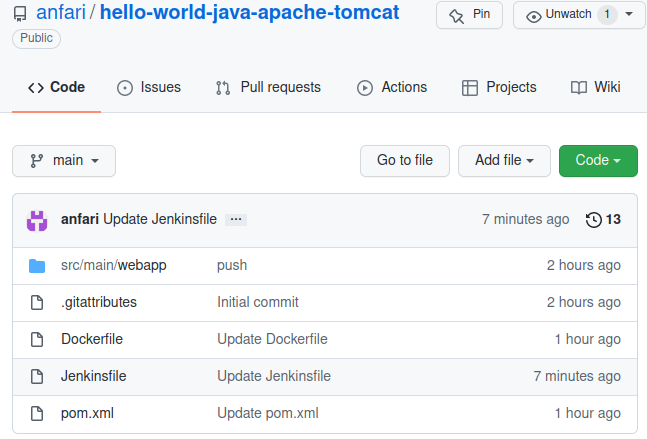
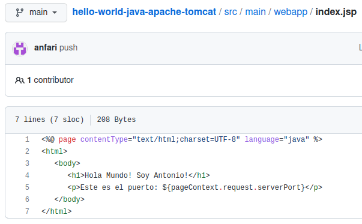
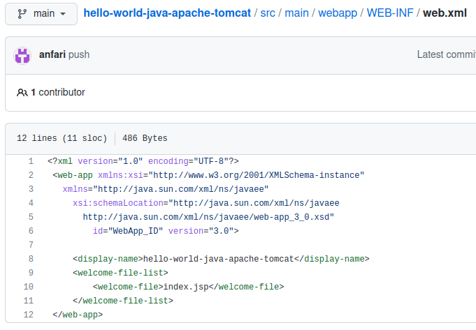
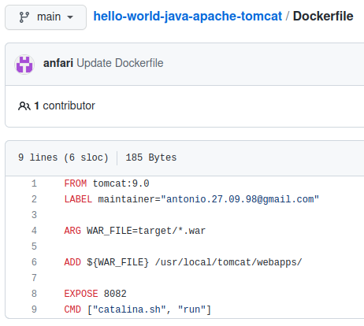
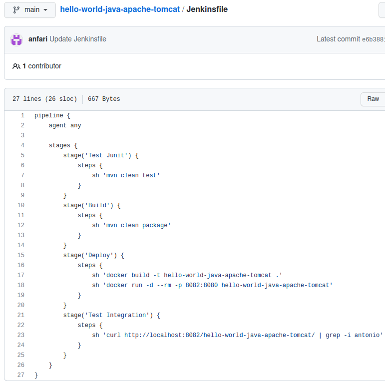
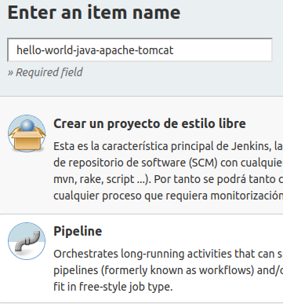
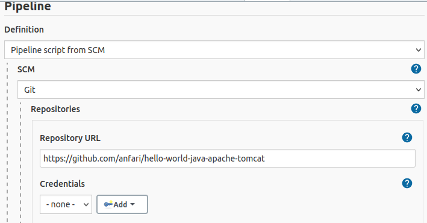
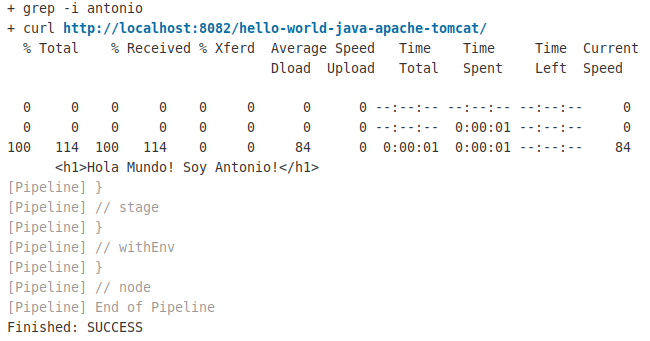
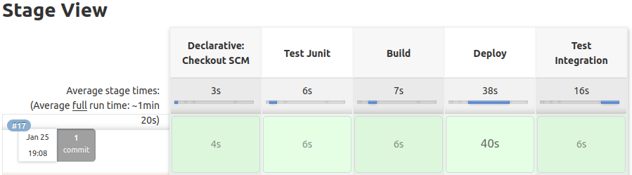
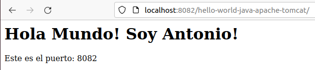

# Pipeline Jenkins en Java y Apache-Tomcat

## Índice
- <a href="#1">Creación repositorio</a>
- <a href="#2">Crear el Dockerfile</a>

# <a name="1">Creación repositorio</a>

Lo primero será crear un repositorio con el proyecto y ficheros de configuración.

En el **index.jsp** añadimos nuestro nombre para hacer las comprobaciones finales.

El nombre que pongamos en el **web.xml** será la ruta para acceder a la aplicación.

En el **Dockerfile** especificamos la versión de Tomcat y la copia del **.war**.

En el **Jenkinsfile** ponemos los pasos que se seguirán.

Como podemos ver, tenemos varias fases:

* Test Junit
* - Ejecutamos los test de la aplicación
* Build
* - Creamos el .war
* Deploy
* - Creamos el contenedor de docker
* - Ejecutamos el contenedor en el puerto especificado
* Test
* - Comprobamos que la pagina final contiene nuestro nombre

# <a name="2">Creación Pipeline</a>

En el panel de control de Jenkins creamos un nuevo Pipeline.

Y añadimos la ruta de nuestro repositorio.

Hecho esto ejecutamos el Pipeline y nos aseguramos que termine correctamente.

También comprobamos que podemos consultar la web desde el navegador.

