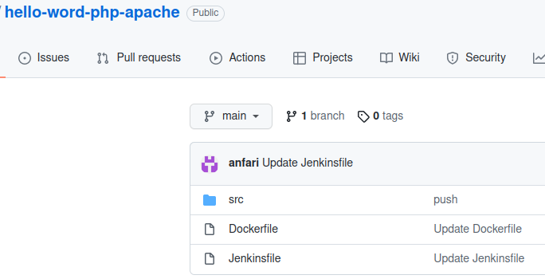
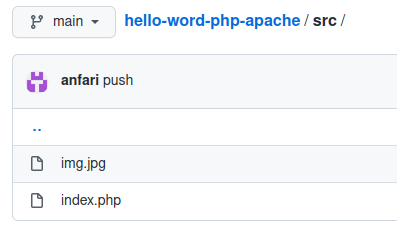
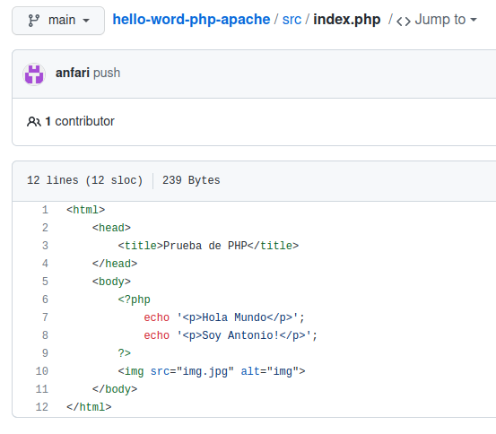
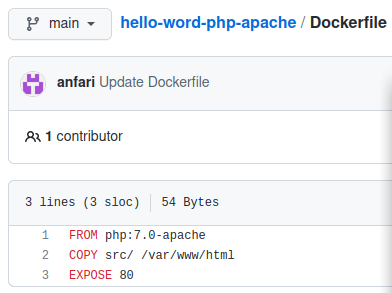
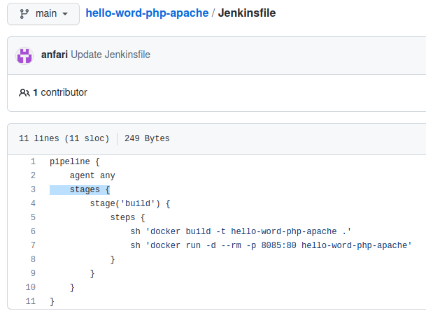
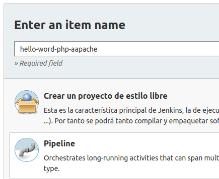
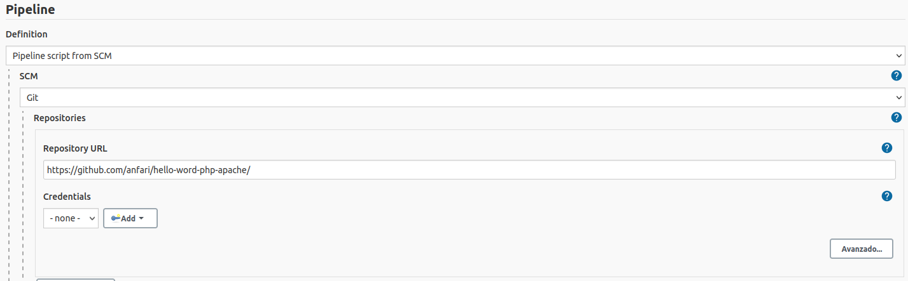
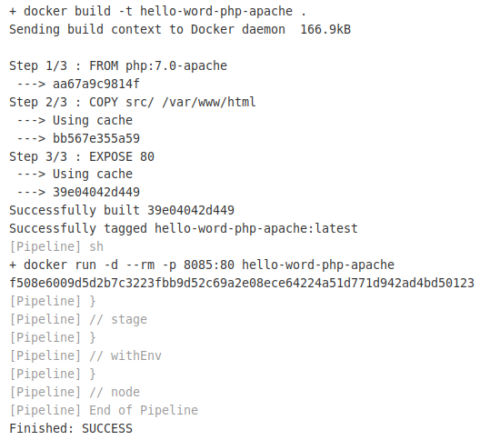
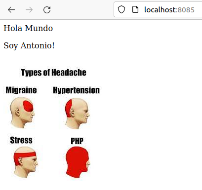

# Pipeline Jenkins en PHP

## Índice
- <a href="#1">Creación repositorio</a>
- <a href="#2">Creación Pipeline</a>

# <a name="1">Creación repositorio</a>

Lo primero que haremos será crear un repositorio con el proyecto a utilizar, que tendrá una estructura como la siguiente.

Dentro de la carpeta **src** tendremos nuestro fichero **index.php** y una imagen que emplearemos en la página.

El fichero php tiene el siguiente contenido:

En el fichero **Dockerfile** especificamos la versión de php y puerto a utilizar entre otras cosas.

En el fichero **Jenkinsfile** especificamos los pasos para la construcción del contenedor y el puerto desde el que conectaremos.

# <a name="2">Creación Pipeline</a>

Desde el panel de control de Jenkins creamos un nuevo Pipeline.

En este caso haremos que se ejecute desde un repositorio Git como se ve a continuación.

Finalmente ejecutamos el Pipeline y comprobamos que la salida es correcta.

Podemos comprobar desde el navegador que la página funciona correctamente.

