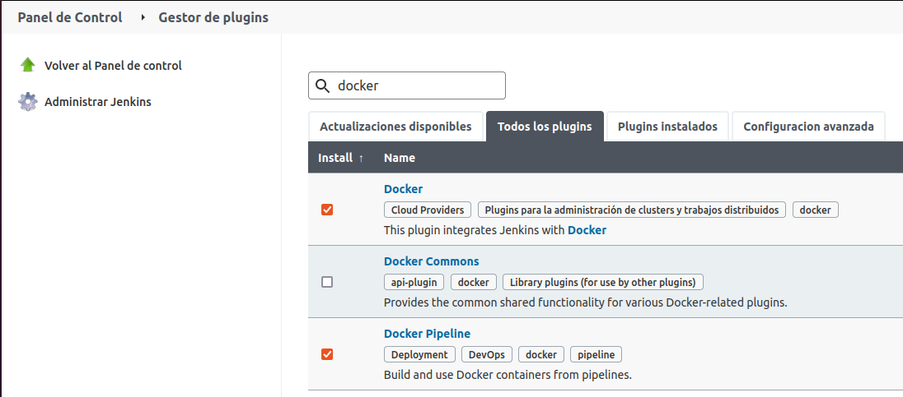

# Pipeline Jenkins

## Índice
- <a href="#1">Requisitos previos</a>
- <a href="#2">Creación Pipeline Java</a>
- <a href="#3">Pipeline Node.js</a>
- <a href="#4">Pipeline Ruby</a>
- <a href="#5">Pipeline Python</a>
- <a href="#6">Pipeline PHP</a>
- <a href="#7">Pipeline Go</a>
- <a href="#8">Panel de Control</a>

# <a name="1">Requisitos previos</a>

Necesitaremos instalar los plugins que nos permitirán que **docker** funcione correctamente, estos son:

* Docker
* Docker Pipeline

Para ello vamos al **Panel de Control → Gestor de plugins** y los buscamos en **Todos los plugins**.

Y esperamos a que se instalen.

# <a name="2">Creación Pipeline Java</a>

Lo primero será desde el **Panel de Control** seleccionar **Nueva Tarea**.

Especificaremos un nombre y seleccionamos **Pipeline**.

Nos aparecerá un menú con muchas opciones, las cuales no necesitaremos actualmente, añadimos una descripción si lo deseamos…

Y en la última opción añadimos las instrucciones a seguir.

Luego simplemente guardamos y lanzamos el Pipeline, en caso de que nos salga un error como el siguiente:

Podemos darnos cuenta de que el usuario Jenkins necesita pertenecer al grupo docker para tener los permisos necesarios, por lo que hacemos eso mismo.

Si volvemos a ejecutarlo el resultado será correcto.

En el Pipeline podemos ver una tabla con las últimas ejecuciones y sus resultados.

Y en el Panel de control podemos consultar todos los Pipelines simultáneamente.

# <a name="3">Pipeline Node.js</a>

Como ya hemos explicado la creación del Pipeline, a continuación solo mostraremos las instrucciones de cada uno y su resultado.

# <a name="4">Pipeline Ruby</a>

# <a name="5">Pipeline Python</a>

# <a name="6">Pipeline PHP</a>

# <a name="7">Pipeline Go</a>

# <a name="8">Panel de Control</a>

Finalmente, como se comentó anteriormente, podemos consultar el estado de todos los Pipelines simultáneamente desde el Panel de Control.

Los iconos que vemos a la izquierda tienen su significado.

El primero significa el resultado de la última ejecución:

* El verde que ha funcionado correctamente.
* La X roja que ha fallado.
* Un icono girando que se encuentra en proceso.
* Un guion que se ha abortado.
* Una exclamación que es inestable.

El segundo icono tiene varios estados:

* Sol: Más del 80% de los test son correctos.
* Sol nublado: Entre el 61% y el 80% son correctos.
* Nublado: Entre el 41% y el 60$ son correctos.
* Lloviendo: Entre el 21% y el 40% son correctos.
* Tormenta: Menos del 21% son correctos.
