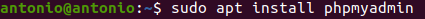

# Construcción de un Servicio de Empresa

## Índice
- <a href="#1">Instalación</a>
-- <a href="#2">MySQL</a>
-- <a href="#3">PHP</a>
-- <a href="#4">PHPMyAdmin</a>
-- <a href="#5">VSFTPD</a>
- <a href="#6">Configuración</a>
-- <a href="#7">Apahce</a>
-- <a href="#8">VSFTPD</a>
-- <a href="#9">MySQL</a>
- <a href="#10">Comprobación</a>
-- <a href="#11">Apache</a>
-- <a href="#12">VSFTPD y PHP</a>
-- <a href="#13">PHPMyAdmin y MySQL</a>


# <a name="1">Instalación</a>

## <a name="2">MySQL</a>

Para instalar MySQL Server ejecutaremos el siguiente comando:

```
sudo apt install mysql-server
```


## <a name="3">PHP</a>

Para PHP adicionalmente debemos instalar unas librerías adicionales para su funcionamiento con Apache y MySQL:

```
sudo apt install php libapache2-mod-php php-mysql
```


## <a name="4">PHPMyAdmin</a>

Para su instalación ejecutamos:

```
sudo apt install phpmyadmin
```



A continuación nos pedirá seleccionar un par de configuraciones, como el servicio que utilizaremos:


Nos avisará de que necesitamos de una base de datos, la cual ya tenemos con MySQL.


Y nos pedirá establecer una contraseña:


## <a name="5">VSFTPD</a>

Para instalar el servicio ftp ejecutamos:

```
sudo apt install vsftpd
```


# <a name="6">Configuración</a>

## <a name="7">Apache</a>

Lo primero que haremos será crear un dominio con nuestro nombre en:

```
/etc/apache2/sites-available/antoniofosystem.conf
```


Y activarlo creando un enlace simbólico en la ruta:

```
/etc/apache2/sites-enabled
```


Crearemos las carpetas que componen su directorio raíz (dentro de esta crearemos también la carpeta sftp)  y creamos un fichero **index.php** como página inicial.


En el fichero **/etc/apache2/apache2.conf** agregamos al final del mismo la siguiente linea para poder acceder a PHPMyAdmin.


## <a name="8">VSFTPD</a>

Lo primero será crear un usuario:


El cual estableceremos como propietario de la carpeta **sftp** del dominio.


Carpeta que estableceremos como su home.


Con esto limitaremos el acceso a la carpeta mediante ftp a este usuario, solo queda modificar el fichero **vsftpd.conf** cambiando la linea **pam_service_name** a ftp, permitiendo que el usuario se conecte.


Para establecer los permisos de la carpeta, desde la aplicación Filezilla hacemos clic derecho en la carpeta raíz y seleccionamos **Atributos de archivo...**


Aquí establecemos los permisos que deseemos.


## <a name="9">MySQL</a>

Necesitamos crear un usuario para la administración de las bases de datos y el acceso a PHPMyAdmin.


Y le otorgamos todos los privilegios para hacerlo administrador.


# <a name="10">Comprobación</a>

## <a name="11">Apache</a>

Si accedemos a www.antoniofosystem.com deberíamos ver la página de inicio que habíamos establecido.


Así como también en  www.antoniofosystem.com/sftp


## <a name="12">VSFTPD y PHP</a>

Utilizando un cliente como Filezilla podemos subir archivos al servidor, accediendo con nuestro usuario **sftp** accederemos directamente a la carpeta **sftp** del dominio.


Si accedemos a la ruta del archivo podemos comprobar su funcionamiento.


## <a name="13">PHPMyAdmin y MySQL</a>

Accediendo a  www.antoniofosystem.com/phpmyadmin podemos comprobar el acceso.


Introduciendo las credenciales del usuario creado en **MySQL** para acceder.


